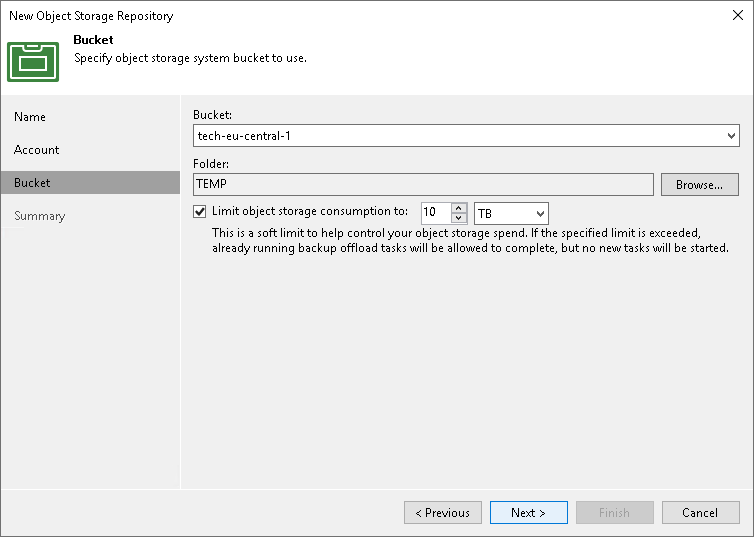

# Step 4. Specify Object Storage Settings

At the Bucket step of the wizard, specify Amazon S3 bucket and folder that will be used to store data:

1. From the Bucket drop-down list, select a bucket.

Make sure that the bucket where you want to store your backup data was created in advance.

1. In the Folder field, select a cloud folder to which you want to map your object storage repository.

To select a folder, click Browse and either select an existing folder or create a new one by clicking New Folder.

1. Select the Limit object storage consumption to check box to define a soft limit that can be exceeded temporarily for your object storage consumption. Provide the value in TB or PB.

