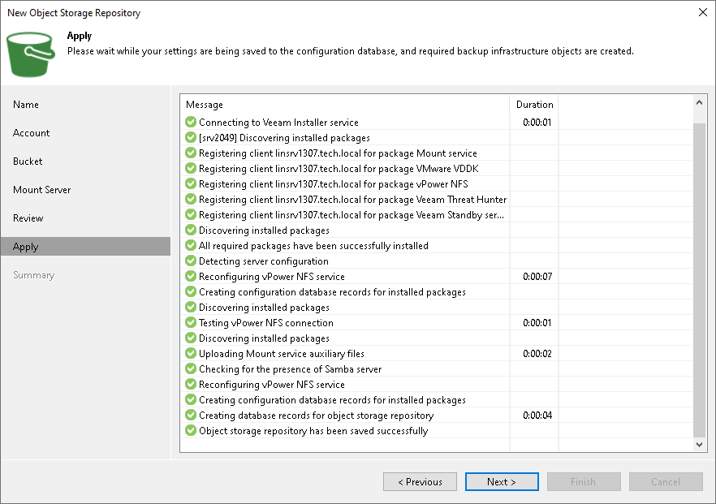

# Step 7. Apply Settings

At the Apply step of the wizard, wait for Veeam Backup & Replication to complete saving your settings to the configuration database and create backup infrastructure objects.

