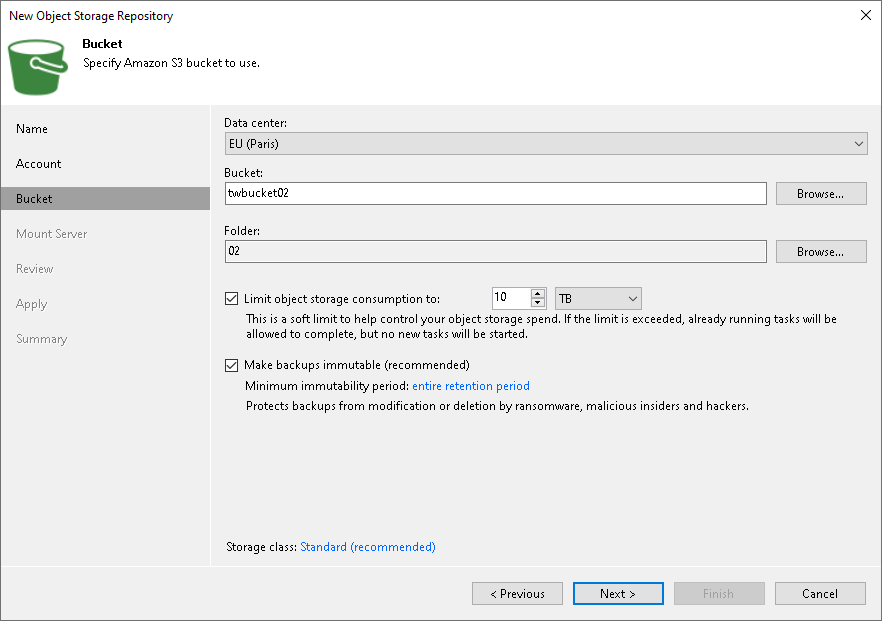
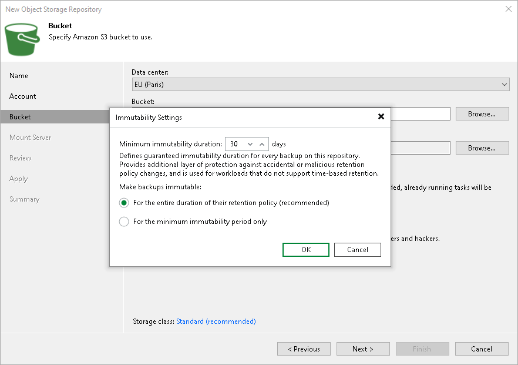
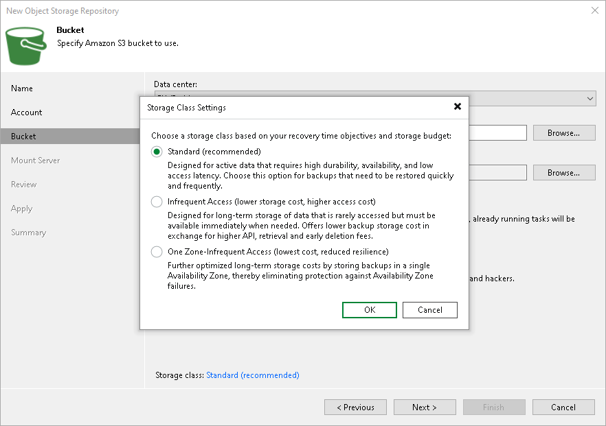

# Step 4. Specify Object Storage Settings

At the Bucket step of the wizard, specify Amazon S3 bucket and folder that will be used to store data:

1. From the Data center drop-down list, select the region where the bucket is located.
2. In the Bucket field, enter a name of the bucket or click Browse to get the necessary bucket.

|  |
| --- |
| Important |
| You must create the bucket where you want to store your backup data beforehand. When you create a bucket, consider Amazon bucket naming rules. It is not recommended that you use dots (.) in the bucket name. For more information on bucket naming rules, see [AWS Documentation](https://docs.aws.amazon.com/AmazonS3/latest/userguide/bucketnamingrules.html). |

If the FIPS-compliant operation mode is enabled and the bucket you want to add is non-FIPS compliant, the warning will be displayed. For more information, see [FIPS Compliance](fips_compliance.md).

1. To the right of the Folder field, click Browse and either select an existing folder or click New Folder.

|  |
| --- |
| Important |
| Veeam Backup & Replication supports specific storage classes. For more information, see [Considerations and Limitations](s3_compatible_limitations.md). |

1. Select the Limit object storage consumption to check box to define a soft limit for your object storage consumption. If this limit is exceeded during a job run, Veeam Backup & Replication will complete the job. However, a new job will not be able to start unless you remove the extra data that exceeds the limit or change the soft limit settings. Provide the value in TB or PB.

Specifying Immutability Settings

To prohibit deletion of blocks of data from object storage, select the Make recent backups immutable (recommended) check box. In the Immutability Settings window, specify how the immutability period is counted and set the immutability period in days:

* Select For the entire duration of their retention policy if you want the immutability period depend on the retention policy of a backup job.

|  |
| --- |
| Important |
| Consider the following:   * If the job retention exceeds the immutability period, the actual retention is counted as job retention policy + Block Generation period. * If the immutability period exceeds the job retention period, the actual retention is counted as immutability period + Block Generation period.   For more information, see [How Immutability Works](hiw_immutability_os.md), |

* Select For the minimum immutability period only if you want to specify the immutability period explicitly. The backup job retention will be skipped.
* Next to the Minimum immutability duration option, provide the necessary value.

Note that the maximum immutability period you can set in the Veeam Backup & Replication UI is 999 days. If you want to set immutability to a longer period, use the [Set-VBRAmazonS3Repository](https://helpcenter.veeam.com/docs/vbr/powershell/set-vbramazons3repository.html?ver=13) cmdlet.

Specifying Amazon S3 Storage Classes

To specify the Amazon S3 storage class that you want to enable for your bucket, click the Standard link to the right of the Storage class field. In the Storage Class Settings window, select one of the following:

* Standard (recommended) — Use this option if you plan to access your data frequently.
* Infrequent Access — Use this option if you plan to access your data infrequently and require fast access in case when data is needed.
* One Zone-Infrequent Access — Use this option if you want to isolate your data and store it in a specific location.

|  |
| --- |
| Important |
| If you enable this option and plan to use this object storage as a performance or capacity tier, do not target to this repository any jobs that constantly send backup data to this storage: scheduled regular backup and backup copy jobs that run without GFS, jobs with transactions logs enabled, jobs created by [Veeam Plug-Ins for Enterprise Applications](protect_applications.md). Otherwise, it will result in higher costs. |

For more information on storage class, see [AWS Documentation](https://aws.amazon.com/s3/storage-classes/).

