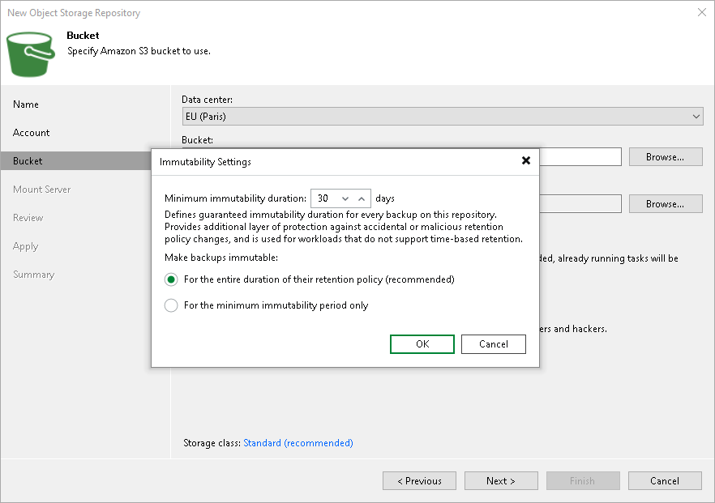
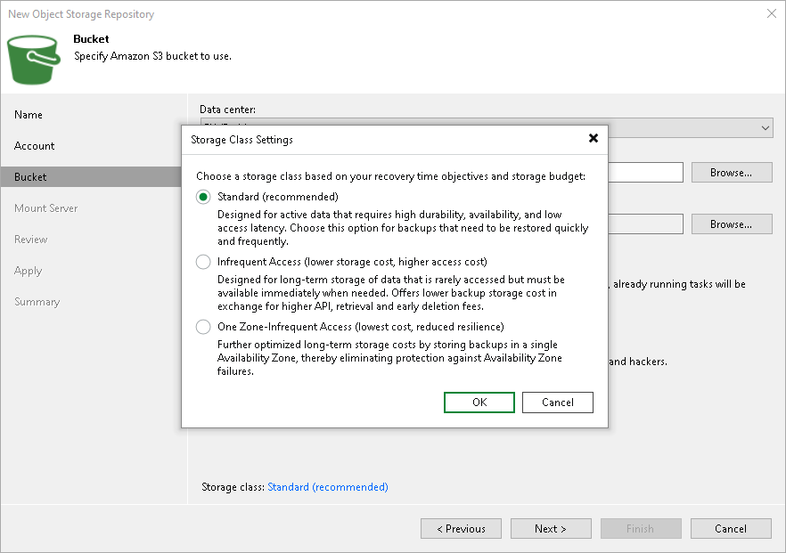

# Step 4. Specify Object Storage Settings

At the Bucket step of the wizard, do the following:

1. [Specify general settings for the Amazon S3 bucket](#bucket).
2. [Specify immutability settings](#immutability).
3. [Specify the Amazon S3 storage class](#storageclass).

Specifying General Settings for Amazon S3 Bucket

To specify general settings for the Amazon S3 bucket:

1. From the Data center drop-down list, select the AWS region where the bucket is located.
2. In the Bucket field, enter a name of the bucket or click Browse to get the necessary bucket.

|  |
| --- |
| Important |
| Consider the following:   * You must create the bucket where you want to store your backup data beforehand. When you create a bucket, consider Amazon bucket naming rules. It is not recommended that you use dots (.) in the bucket name. For more information on bucket naming rules, see [AWS Documentation](https://docs.aws.amazon.com/AmazonS3/latest/userguide/bucketnamingrules.html). * You cannot browse for buckets when adding the AWS edition storage vault. * To specify a bucket for the AWS edition storage vault, you must use the Vault ID as the bucket name.To obtain the storage vault ID, copy the value in the Vault ID field in Veeam Data Cloud Vault. For more information, see the [Viewing Storage Vault Details](https://helpcenter.veeam.com/docs/vdc/userguide/vault_storage_vaults_edit.html#view_vault) section in the Veeam Data Cloud User Guide. |

If the FIPS-compliant operation mode is enabled and the bucket you want to add is non-FIPS compliant, the warning will be displayed. For more information, see [FIPS Compliance](fips_compliance.md).

1. To the right of the Folder field, click Browse and either select an existing folder or click New Folder.

|  |
| --- |
| Important |
| Veeam Backup & Replication supports specific storage classes. For more information, see [Considerations and Limitations](s3_compatible_limitations.md). |

1. Select the Limit object storage consumption to check box to define a soft limit for your object storage consumption. If this limit is exceeded during a job run, Veeam Backup & Replication will complete the job. However, a new job will not be able to start unless you remove the extra data that exceeds the limit or change the soft limit settings. Provide the value in TB or PB.
2. If another backup server already manages the object storage repository, you will be prompted to either add it as a read-only repository or take ownership of it from the backup server currently managing it in read-write mode. For more information, see the [Read-only mode](object_storage_repository.md#readOnlyAccess) subsection. To enable the read-only access, select the Enable read-only access check box.

   |  |
   | --- |
   | Important |
   | Consider the following:  * This check box is available only for immutable object storage repositories, added as a standalone repository or as the performance or capacity extent of a scale-out backup repository. * You cannot change this option after you add the object storage repository to the backup infrastructure. |

Specifying Immutability Settings

Immutability prohibits deletion of blocks of data from your object storage repository.

To enable immutability:

1. Select the Make backups immutable (recommended) check box.
2. In the Immutability Settings window, specify how the immutability period is counted and set the immutability period in days:

* Select the For the entire duration of their retention policy option if you want the immutability period depend on the retention policy of a backup job.

|  |
| --- |
| Important |
| Consider the following:   * If the job retention exceeds the immutability period, the actual retention is counted as job retention policy + Block Generation period. * If the immutability period exceeds the job retention period, the actual retention is counted as immutability period + Block Generation period. * The default immutability period is 30 days. You can set the immutability period to different values in the Veeam Backup & Replication UI. The minimum immutability period is 1 day, and the maximum is 999 days.   For more information, see [How Immutability Works](hiw_immutability_os.md). |

* Select the For the minimum immutability period only option if you want to specify the immutability period explicitly. The backup job retention will be skipped.
* Next to the Minimum immutability duration option, provide the necessary value.

Specifying Amazon S3 Storage Class

The Amazon S3 storage class defines how your data is stored and managed in the bucket, affecting cost, availability, and access frequency. For more information on storage classes, see [AWS Documentation](https://aws.amazon.com/s3/storage-classes/).

To specify the storage class, do the following:

1. Click the Standard link to the right of the Storage class field.
2. In the Storage Class Settings window, select one of the following:

* Standard (recommended): Use this option if you plan to access your data frequently.
* Infrequent Access: Use this option if you plan to access your data infrequently and require fast access in case when data is needed.

|  |
| --- |
| Important |
| You must use this option for AWS Edition of Veeam Data Cloud Vault. Other storage classes for this type of object storage repository are not supported. |

* One Zone-Infrequent Access: Use this option if you want to isolate your data and store it in a specific location.

|  |
| --- |
| Important |
| If you enable this option and plan to use this object storage as a performance or capacity tier, do not target to this repository any jobs that constantly send backup data to this storage: scheduled regular backup and backup copy jobs that run without GFS, jobs with transactions logs enabled, jobs created by [Veeam Plug-Ins for Enterprise Applications](protect_applications.md). Otherwise, it will result in higher costs. |

Page updated 2026-07-28

