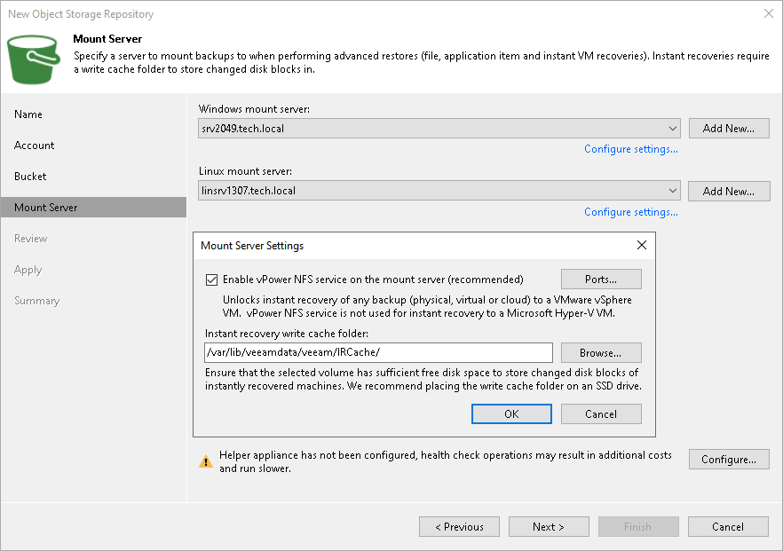
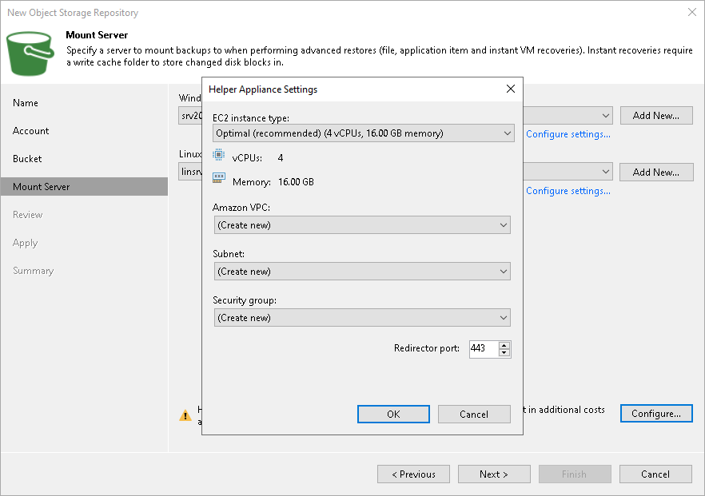

# Step 5. Specify Mount Server Settings

At the Mount Server step of the wizard, specify settings for the mount server that you plan to use for restore operations, and configure a helper appliance. The helper appliance is a temporary EC2 instance that Veeam Backup & Replication deploys in your Amazon EC2, to perform a health check of backup files and apply retention to unstructured data backup files. For more information, see [Health Check for Object Storage Repositories](health_check_os.md) and [Helper Appliance in Unstructured Data Backup](unstructured_data_backup_in_object_storage.md#helper). After Veeam Backup & Replication completes these operations, it removes the helper appliance from Amazon EC2.

Specifying Mount Server Settings for VMware vSphere Platform

To configure the mount server settings:

1. From the Windows mount server list, select a Microsoft Windows server that you want to use as a mount server. The Windows mount server list contains only Microsoft Windows servers added to the backup infrastructure. If the server is not added to the backup infrastructure yet, click Add New on the right to open the New Windows Server wizard. For more information, see [Adding Microsoft Windows Servers](add_windows_server.md).
2. From the Linux mount server list, select a Linux server that you want to use as a mount server. The Linux mount server list contains only RHEL/Rocky-based Linux servers added to the backup infrastructure and Veeam Software Appliance. If the server is not added to the backup infrastructure yet, click Add New on the right to open the New Linux Server wizard. For more information, see [Adding Linux Servers](add_linux_server.md).
3. Click Configure settings to configure other settings for the selected mount servers:

1. Select the Enable vPower NFS service on the mount server check box to allow the Veeam vPower NFS Service access the object storage repository. Veeam Backup & Replication will enable the Veeam vPower NFS Service on the necessary mount server. For more information, see [Veeam vPower NFS Service](vpower_nfs_service.md).

|  |
| --- |
| Important |
| Consider the following:   * vPower NFS settings are not applicable in Microsoft Hyper-V environments. * Do not enable Microsoft Windows NFS services on the machine where you install the Veeam vPower NFS Service. If Microsoft NFS services and Veeam vPower NFS Service are enabled on the same machine, both services may fail to work correctly. |

1. Click Ports to customize network ports used by the Veeam vPower NFS Service. In the vPower NFS Port Settings window, specify the following settings:

* Next to the Mount Port section, specify the port that the Veeam vPower NFS Service will use to mount the vPower NFS datastore to the ESXi host.
* Next to the vPower NFS port section, specify the port that the Veeam vPower NFS Service will use to connect to the target NFS share.

For information on ports used by default, see [Ports](used_ports.md).

1. In the Instant recovery write cache folder field, specify a folder to keep cache that is created during mount operations.

Configuring Helper Appliance

To configure the helper appliance, at the Mount Server step, click Configure and in the Helper Appliance Settings window, specify the following settings:

1. From the EC2 instance type drop-down list, select the EC2 instance type for the helper appliance. The speed and cost of operations that the helper appliance performs depend on the EC2 instance type. For information on EC2 instance types, see [AWS Documentation](https://aws.amazon.com/ec2/instance-types/). For details on the EC2 instant types used by Veeam Backup & Replication, see [this Veeam KB article](https://www.veeam.com/kb4317).
2. From the Amazon VPC drop-down list, select the Amazon VPC where Veeam Backup & Replication will launch the EC2 instance. For information on the Amazon VPC, see [AWS Documentation](https://docs.aws.amazon.com/vpc/latest/userguide/what-is-amazon-vpc.html).

To be able to select the necessary VPC from the drop-down list, you must create it beforehand as described in the [AWS Documentation](https://docs.aws.amazon.com/vpc/latest/userguide/working-with-vpcs.html).

1. From the Subnet drop-down list, select the subnet where the helper appliance will reside. For information on the subnets for Amazon VPC, see [AWS Documentation](https://docs.aws.amazon.com/vpc/latest/userguide/configure-subnets.html).

To be able to select the necessary subnet from the drop-down list, you must create it beforehand as described in the [AWS Documentation](https://docs.aws.amazon.com/vpc/latest/userguide/working-with-vpcs.html).

1. From the Security group drop-down list, select a security group that will be associated with the helper appliance. For information on security groups for Amazon VPC, see [AWS Documentation](https://docs.aws.amazon.com/vpc/latest/userguide/VPC_SecurityGroups.html).

To be able to select the necessary security group from the drop-down list, you must create it beforehand as described in the [AWS Documentation](https://docs.aws.amazon.com/vpc/latest/userguide/VPC_SecurityGroups.html#WorkingWithSecurityGroups).

|  |
| --- |
| Important |
| If you select the Create new option, Veeam Backup & Replication will create a new security group with the inbound rules that allow connection using the 443 and 22 ports from everywhere (0.0.0.0/0). |

1. In the Redirector port field, specify the TCP port that Veeam Backup & Replication will use to route requests between the helper appliance and backup infrastructure components.
2. Click OK.

