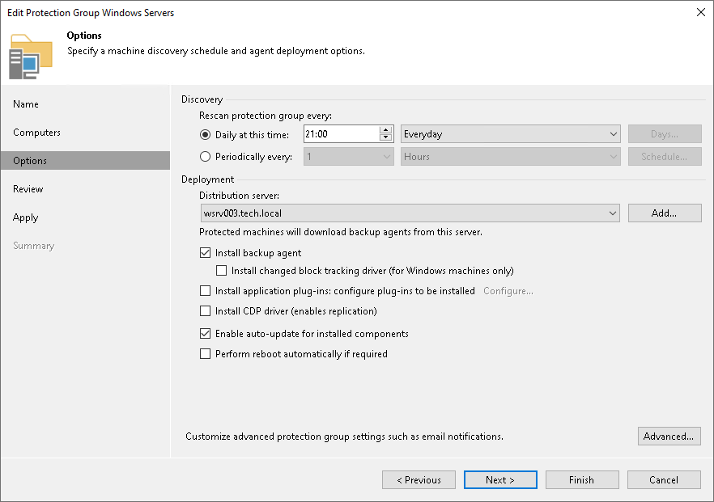

# Deploying Hotfix on Protected Computers

A Veeam Agent hotfix is a set of updated Veeam Agent packages that addresses a certain issue in the product. This scenario describes how to deploy a hotfix on protected computers with one of the following installed Veeam Agents:

* Veeam Agent for Microsoft Windows
* Veeam Agent for Linux
* Veeam Agent for Unix (Veeam Agent for Oracle Solaris and Veeam Agent for IBM AIX)

Veeam Software issues a hotfix in one of the following cases:

* To mitigate an existing issue in the product. In this case, a hotfix is provided by Veeam Customer Support.
* [For Veeam Agent for Linux hotfix] To add support of a new Linux distribution version to the product. In this case, a hotfix is available in the [Veeam software repository](https://repository.veeam.com/packages/).

If you have several computers with Veeam Agent installations managed by Veeam Backup & Replication, you can centrally deploy a hotfix on all managed agents. Keep in mind that this scenario is not available for Veeam Agent computers added to protection groups for pre-installed Veeam Agents.

Prerequisites

Before you deploy a Veeam Agent hotfix on protected computers:

1. Check that protected computers are powered on and can be connected over the network.
2. Check that there are no running jobs.

We recommend that you do not stop running jobs and let them complete successfully. Disable any periodic jobs temporarily to prevent them from starting during the upgrade. If protected computers run VSS-aware applications and backup of database logs (Microsoft SQL Server transaction logs or Oracle archived logs) is enabled in the backup job for these computers, disable this backup job too.

1. Check that automatic Veeam Agent deployment options are enabled in the protection group settings:

1. Open the Inventory view.
2. In the inventory pane, expand the Physical and Cloud Infrastructure node.
3. In the inventory pane, select the protection group that contains computers with an outdated Veeam Agent installed and click Edit Group on the ribbon or right-click the protection group that you want to edit and select Properties.

1. At the Options step of the wizard, in the Deployment section, make sure that the Install backup agent automatically and Auto-update backup agent check boxes are selected.

Deployment Procedure for Protected Computers

The hotfix deployment procedure differs depending on the OS of the server where Veeam Backup & Replication is installed:

* If you work with Veeam Backup & Replication on Linux, upload the hotfix using the Veeam Host Management console as described in section [Installing Private Hotfixes](https://helpcenter.veeam.com/docs/vbr/userguide/update_appliance_install_updates.html?ver=13#installing-updates-automatically).
* If you work with Veeam Backup & Replication on Microsoft Windows, perform the following steps depending on the OS running on the protected computers:

* [Deployment procedure for Microsoft Windows computers](appendix_a_centralized_hotfix_deployment_windows.md)
* [Deployment procedure for Linux computers](appendix_a_centralized_hotfix_deployment_linux.md)
* [Deployment Procedure for Unix Computers](appendix_a_centralized_hotfix_deployment_unux.md)

