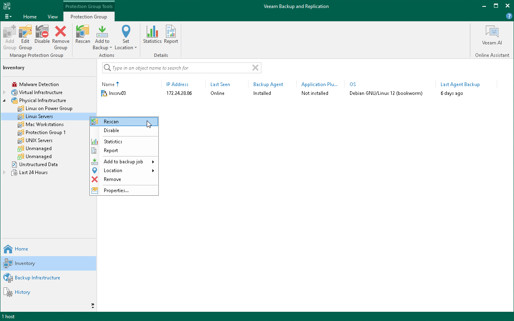

# Deployment Procedure for Linux Computers

In this article

Before You Begin

Hotfixes released by Veeam for Veeam Agent for Linux can contain updated packages for all or selected components of the Veeam Agent architecture:

* If the hotfix affects all Veeam Agent for Linux packages, follow the [general procedure](#general) of deploying a hotfix for Veeam Agent for Linux. The general procedure instructions are further illustrated with [Example 1](#example1).
* If the hotfix contains only an updated kernel module package, editing of the Veeam Agent for Linux package index file (Step 3 of the general procedure) is not required. The simplified procedure of hotfix deployment is illustrated in [Example 2](#example2).

General Procedure for Deploying Hotfix on Linux Computers

To deploy a hotfix on Linux computers included in a protection group, perform the following steps:

1. Obtain the hotfix from Veeam Customer Support. To do this, [open a support case](https://my.veeam.com/#/open-case/step-1?ad=in-text-link).
2. Save Veeam Agent for Linux packages and their manifest files to the following folder on the Veeam backup server:

For RHEL / Oracle Linux / SLES

|  |
| --- |
| C:\ProgramData\Veeam\Agents\fixes\val\x64\rpm |

For Debian / Ubuntu

|  |
| --- |
| C:\ProgramData\Veeam\Agents\fixes\val\x64\deb |

1. Replace the names of the Veeam Agent for Linux packages in the index file:

1. Open the ValPackageIndex.xml file that is located in the following folder on the Veeam backup server:

|  |
| --- |
| C:\ProgramData\Veeam\Agents\val |

1. In the ValPackageIndex.xml file, locate packages that you want to update. Replace their names with names of Veeam Agent for Linux packages you saved in Step 2. After that, save changes and close the index file. For more information on deploying a hotfix for Veeam Agent for Linux version 13.0.1, see [Example 1](#example1).

1. Rescan the protection group:

1. Open the Inventory view.
2. In the inventory pane, expand the Physical and Cloud Infrastructure node.
3. In the inventory pane, select the necessary protection group and click Rescan on the ribbon or right-click the protection group and select Rescan.

During the rescan, Veeam Backup & Replication will use updated packages specified in the index file to install Veeam Agent for Linux version with the hotfix on protected computers.

Example 1: Deploying a Hotfix for Veeam Agent for Linux Using General Procedure

In this example, Veeam issued a hotfix for Veeam Agent for Linux 13.0.1 for RHEL 9 and you want to deploy it on your Veeam Agent computers.

The hotfix consists of the following Veeam Agent packages:

* blksnap-13.0.1.99-1.noarch.rpm
* blksnap-13.0.1.99-1.noarch.rpm.manifest.xml
* veeam-13.0.1.99-1.el9.x86\_64.rpm
* veeam-13.0.1.99-1.el9.x86\_64.rpm.manifest.xml
* kmod-blksnap-13.0.1.99-1.el9.x86\_64.rpm
* kmod-blksnap-13.0.1.99-1.el9.x86\_64.rpm.manifest.xml

To deploy the hotfix, you need to do the following:

1. Obtain all updated Veeam Agent for Linux packages from Veeam Customer Support. To do this, [open a support case](https://my.veeam.com/#/open-case/step-1?ad=in-text-link).
2. Save the packages and their manifest files to the following folder on the Veeam backup server:

|  |
| --- |
| C:\ProgramData\Veeam\Agents\fixes\val\x64\rpm |

You do not need to delete obsolete Veeam Agent for Linux packages you want to update.

1. Edit the index file located in the following folder on the Veeam backup server:

|  |
| --- |
| C:\ProgramData\Veeam\Agents\fixes\val |

1. Open the ValPackageIndex.xml file.
2. Locate the packages that you want to update and replace their version and names with version and names of the packages you saved in step 2.

Usually, the packages that are available as a hotfix have a build version that is different from the obsolete packages. In this scenario, obsolete packages have the 13.0.1.95 build version and the updated packages have the 13.0.1.99 build version.

In the example below, replaced package version and names are highlighted in green:

|  |
| --- |
| ...  <Distribution id="RHEL" displayName="Red Hat">  ...    <!-- EL9 -->    <Version majorVersions="9">       <Packages version="13.0.1.99" arch="x64">          <driver\_noarch value="blksnap-13.0.1.99-1.noarch.rpm"/>          <driver\_uefi\_cert value="veeamsnap-ueficert-13.0.1.95-1.noarch.rpm"/>          <driver\_bin value="kmod-blksnap-13.0.1.99-1.el9.x86\_64.rpm"/>          <veeam value="veeam-13.0.1.99-1.el9.x86\_64.rpm"/>       </Packages>    </Version>  </Distribution>  .... |

1. Save changes and close the index file.

1. Rescan the protection group.

Example 2: Deploying a Hotfix for Veeam Agent for Linux Using Simplified Procedure

In this example, Veeam issued a hotfix for Veeam Agent for Linux 13.0.1 for RHEL 9 and you want to deploy it on your Veeam Agent computers.

The hotfix consists of the following Veeam Agent packages:

* kmod-blksnap-patch-13.0.1.99-1.el9.x86\_64.rpm
* kmod-blksnap-patch-13.0.1.99-1.el9.x86\_64.rpm.manifest.xml

To deploy the hotfix, you need to do the following:

1. Obtain all updated Veeam Agent for Linux packages from Veeam Customer Support. To do this, [open a support case](https://my.veeam.com/#/open-case/step-1?ad=in-text-link).

1. Save the package and its manifest file to the following folder on the Veeam backup server:

|  |
| --- |
| C:\ProgramData\Veeam\Agents\fixes\val\x64\rpm |

1. Rescan the protection group.

Page updated 11/14/2025

Page content applies to build 13.0.1.1071
