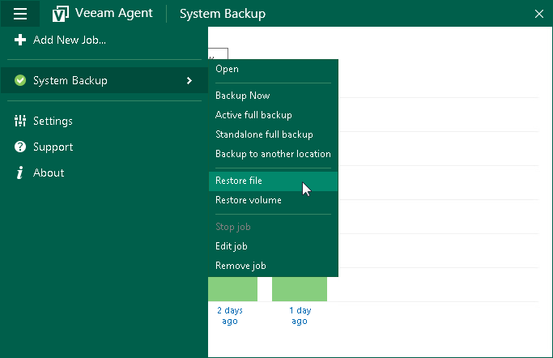
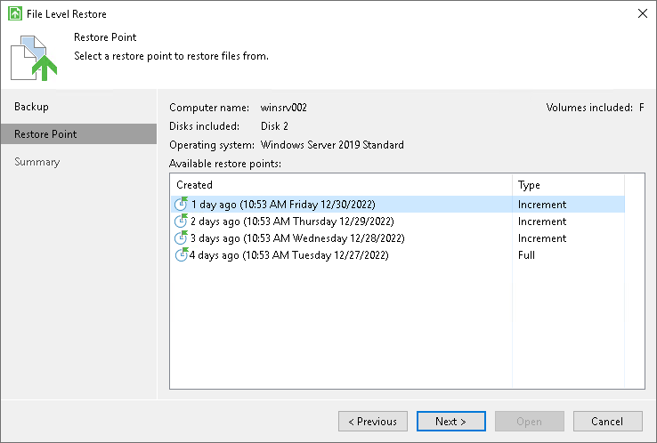
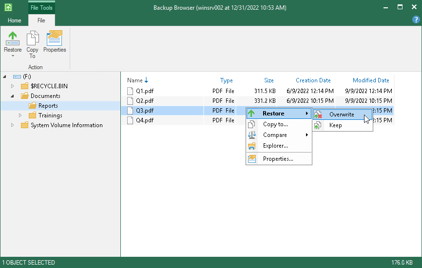

# Restoring Files from Backup Without Administrator Privileges

If you have Veeam Agent for Microsoft Windows installed on your computer and you work on this computer under an account that does not have Administrator privileges, you can still restore files from the file-level backup.

This scenario describes how to restore a file from the backup under an account that does not have local administrator permissions to its original location.

Before restoring, check the following prerequisites:

* Your Veeam Agent computer must be a member of a protection group for which file-level restore without Administrator privileges is allowed. To learn more, see [Veeam Agent for Microsoft Windows Settings](agents_protection_group_advanced_vaw.md).
* You must restore from the backup created by a backup job managed by Veeam Agent. To learn more, see Working with [Veeam Agent Backup Jobs and Policies](backup_job_tasks.md).

* You must restore from the backup stored on Veeam backup repository or Veeam Cloud Connect repository.
* You must restore from the backup of the same Veeam Agent computer.
* You must open the restore wizard from the Veeam Agent for Microsoft Windows control panel.

To restore files, perform the following operations.

1. On the Veeam Agent computer, double-click the Veeam Agent for Microsoft Windows icon in the system tray, or right-click the icon in the system tray and select Control Panel.
2. From the main menu in the upper left corner, hover over the name of the necessary job and select Restore file to open the File Level Restore wizard.

Consider when you work on the Veeam Agent computer under an account that does not have Administrator privileges, you can open the File Level Restore wizard only from the Veeam Agent for Microsoft Windows control panel. If you try to open the wizard from the system tray, Veeam Agent will ask you to enter Administrator credentials.

1. In the File Level Restore wizard, select a restore point from which you want to restore the file.

1. At the Summary step, click Open. Veeam Agent will display the backup file content in the Veeam Backup browser.
2. Locate the file you want to restore, right-click it and select Restore > Overwrite. The file will be restored to its original location.

Consider that access rights to files and folders are managed by Veeam Agent computer OS. When you cannot access the folder in the original location, you cannot view the content of this folder in the Veeam Backup browser as well. If you select file to restore, but do not have enough access rights to restore it, Veeam Agent will not restore the file and will display an error message in the restore job session.

To get the access rights you need, you can switch to another system user with the Veeam Backup browser. To learn more, see the [Elevating Access Rights](https://helpcenter.veeam.com/docs/agentforwindows/userguide/files_restore_elevate.html?ver=13) section in the Veeam Agent for Microsoft Windows User Guide.

