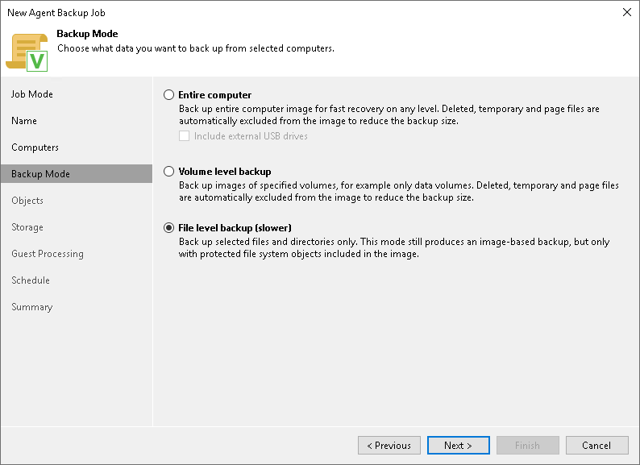
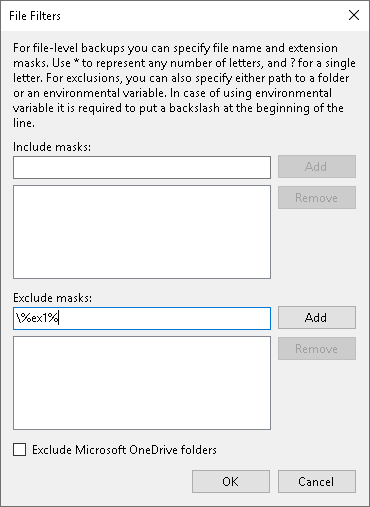
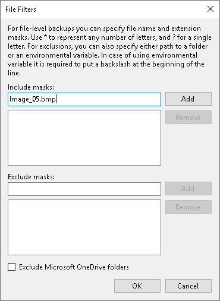
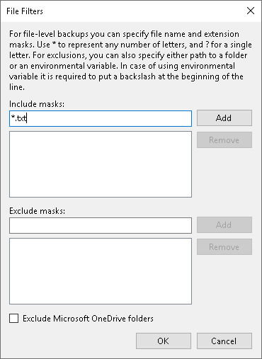
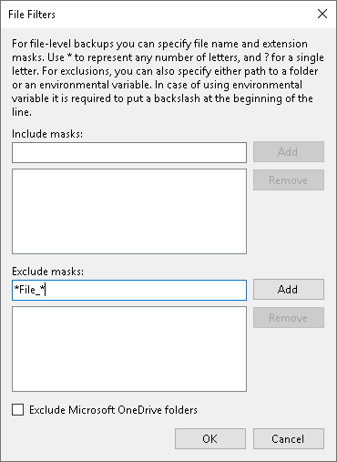

# Using Filters in Backup Jobs for Windows Computers

When you create or edit a Veeam Agent backup job for a Microsoft Windows computer in the Veeam Backup & Replication console, you can include and exclude files and folders from the backup job scope by using include and exclude masks as described in section [Specifying Folders to Back Up](agent_job_folders.md). This topic demonstrates several basic scenarios you may want to implement in your infrastructure.

Before You Begin

Before you configure filters, consider the following:

* This topic covers the file filtering functionality available for a backup job created by Veeam Agent operating in the managed mode.

The settings of a backup job created by Veeam Agent operating in the managed mode provide additional file filtering capabilities compared to the settings available for a backup job created by Veeam Agent operating in the standalone mode. For example, when you create a backup job in the Veeam Backup & Replication console, you can specify paths and system environment variables in exclude masks. To learn more about setting up file filters for backup jobs when Veeam Agent operates in the standalone mode, see the [How to Use Filters to Define File-Level Backup Scope](https://helpcenter.veeam.com/docs/agentforwindows/userguide/howto_select_backup_items.html?ver=13) section in the Veeam Agent for Windows User Guide.

* All backup scenarios in this topic are performed in the file-level backup mode.

A file-level backup job may contain entire volumes and individual folders or files from the other volumes (this is referred to as hybrid backup job). In this case, entire volumes are processed using volume-level backup mode while specific folders from other volumes are processed using file-level backup mode. In the hybrid backup job, filters work in the following way:

* File name and file type masks are applied only to the folders specified in the backup scope and not the entire volumes.
* Masks that contain paths are applied to the selected folders and entire volumes.

* Depending on the type of the object in the backup scope, during job execution Veeam Agent behaves differently:

* When you select an entire volume as an object of a file-level backup, Veeam Agent adds backup exclusions to the FilesNotToSnapshot registry key, triggers creation of the volume shadow copy (VSS snapshot), reads data from the VSS snapshot and saves the data to a backup repository.

To learn more about the FilesNotToSnapshot registry key, see [this Microsoft article](https://docs.microsoft.com/en-us/windows/win32/vss/excluding-files-from-shadow-copies).

During backup, Veeam Agent will ignore any filters configured for this volume.

|  |
| --- |
| NOTE |
| By default, Microsoft Windows does not include some files into the VSS snapshot — for example, temporary files, Microsoft Outlook .ost files and so on. As a result, these files are not included into Veeam Agent backups too. To learn how you can override this default behavior, see [this Veeam KB article](https://www.veeam.com/kb3181). |

* When you select an individual folder as an object of a file-level backup, Veeam Agent reads all data from the VSS snapshot first, then applies filters defined in the job configuration to save the data.

* When you specify include masks, the backup will contain only the data that matches these masking criteria within the backup scope. When you specify exclude masks, the backup will contain all data from the backup scope except the data that matches these masking criteria.

Setting Up File Filters for Backup Scope

To specify file filters when you create a new backup job, do the following:

1. At the Backup Mode step of the Backup Job wizard, select the File level backup option.

1. At the Objects step, select the directories to back up.

You can apply filters only to the folders included in the backup scope.

1. Click Advanced; then in the File Filters window, use masks to include or exclude specific files and folders.

|  |
| --- |
| NOTE |
| You cannot apply filters to Operating system folders. |

Common Filter Configurations

To learn how to use filters for a more granular definition of a backup scope, see the following scenarios:

* [Excluding a Folder Using Full Path](#IncExcl_01).
* [Excluding a Folder Using an Environment Variable in the Path](#IncExcl_02).
* [Excluding a Folder Using a Wildcard Character in the Path](#InclExcl_03).
* [Including or Excluding Specific Files](#IncExcl_06).
* [Including or Excluding Files by File Type](#IncExcl_05).
* [Including or Excluding Files Whose Names Contain a Specific Sequence of Characters](#IncExcl_04).
* [Including or Excluding Files Named According to a Convention](#IncExcl_07).

Excluding a Folder Using Full Path

You can exclude a folder from the backup by specifying a full path to it. In this example, we will exclude the E:\Data\2023 folder from the backup scope.

1. In the Exclude masks field, enter the full path to the folder — E:\Data\2023.

1. Click Add.
2. Click OK to complete the configuration.

As a result, the backup will contain all data from the backup scope except the E:\Data\2023 folder.

Excluding a Folder Using an Environment Variable in the Path

You can exclude a folder by specifying a system environment variable in its path. In this example, we will exclude the E:\Data\2023\Drafts folder that is defined as the ex1 variable. To do this:

1. In the Exclude masks field, enter \%ex1%.

|  |
| --- |
| IMPORTANT |
| When you specify a system environment variable in a mask, you must precede such variable with a backslash. |

1. Click Add.
2. Click OK to complete the configuration.

As a result, the backup will contain all data from the backup scope except the E:\Data\2023\Drafts folder.

|  |
| --- |
| NOTE |
| If you use a system environment variable in the file filter for the backup, consider the following:   * You can use only system environment variables defined for the Local System account on computers added to the backup job. You cannot use user environment variables (Veeam Agent works under the NT AUTHORITY\SYSTEM account, so all exclusions are treated accordingly). * You cannot use environment variables that contain multiple values or other environment variables. |

Excluding a Folder Using a Wildcard Character in the Path

To exclude a folder from the backup, you can specify a partial path with a wildcard at the end.

|  |
| --- |
| NOTE |
| Note that you cannot use a wildcard in the middle of the path. For example, specifying E:\\*\2023 will cause an error during backup. To recursively exclude files from specific subfolders of the selected root folder, you can use the standard OS mechanism for exclusions. |

In this example, we will exclude all subfolders of the E:\Data folder whose names begin with 2023. To do this:

1. In the Exclude masks field, enter E:\Data\2023\*.

1. Click Add.
2. Click OK to complete the configuration.

As a result, the backup will contain all data from the backup scope except the folders whose names start with 2023 — for example 2023\_Jan or 2023\_Reports.

Including or Excluding Specific Files

You can select specific files for inclusion or exclusion. In this example, we will include only the Image\_05.bmp file into the backup. To do this:

1. In the Include masks field, enter Image\_05.bmp:

1. Click Add.
2. Click OK to complete the configuration.

As a result, the backup will contain only the Image\_05.bmp file from the specified backup scope.

Including or Excluding Files by File Type

You can include or exclude files by their type using a wildcard character instead of the file name — for example, \*.docx will select all Microsoft Word files with such extension in the backup scope.

In this example, we will back up all text files in the .txt format. To do this:

1. In the Include masks field, enter \*.txt to select all files with the .txt extension.

1. Click Add.
2. Click OK to complete the configuration.

As a result, the backup will contain all the text files in the .txt format from the backup scope.

|  |
| --- |
|  NOTE |
| You can combine include and exclude masks as needed. For example, you can include all .pdf files into the backup scope and exclude the ones that contain the word draft in their name by specifying \*.pdf in the include mask and \*draft\* in the exclude mask. |

Including or Excluding Files Whose Names Contain a Specific Sequence of Characters

You can include or exclude files whose names contain a specific sequence of characters. In this example, we will exclude files of any type that have File\_ in the name. To do this:

1. In the Exclude masks field, enter \*File\_\*.

This will select all files that contain this sequence of characters in any position in the file name.

1. Click Add.
2. Click OK to complete the configuration.

As a result, the backup will contain all data from the backup scope except the files that contain File\_ in the name — for example, File\_01.txt or Draft\_File\_05.pdf.

Including or Excluding Files Named According to a Convention

You may have a set of files named according to a convention — for example, File\_XX.txt where XX is a two-digit number. You can use a single-character wildcard to select specific files for inclusion or exclusion. In this example, we will exclude files named according to the File\_XX.txt convention with numbers ranging from 01 to 09:

1. In the Exclude masks field, enter File\_0?.txt.

1. Click Add.
2. Click OK to complete the configuration.

As a result, the backup will contain all data from the backup scope except the text files whose names contain a digit ranging from 1 to 9 in the position of the wildcard character specified in the mask — for example, File\_01.txt, File\_07.txt and so on. Keep in mind that this filter will also exclude files whose names contain any other character in the wildcard position — for example, File\_0A.txt.

