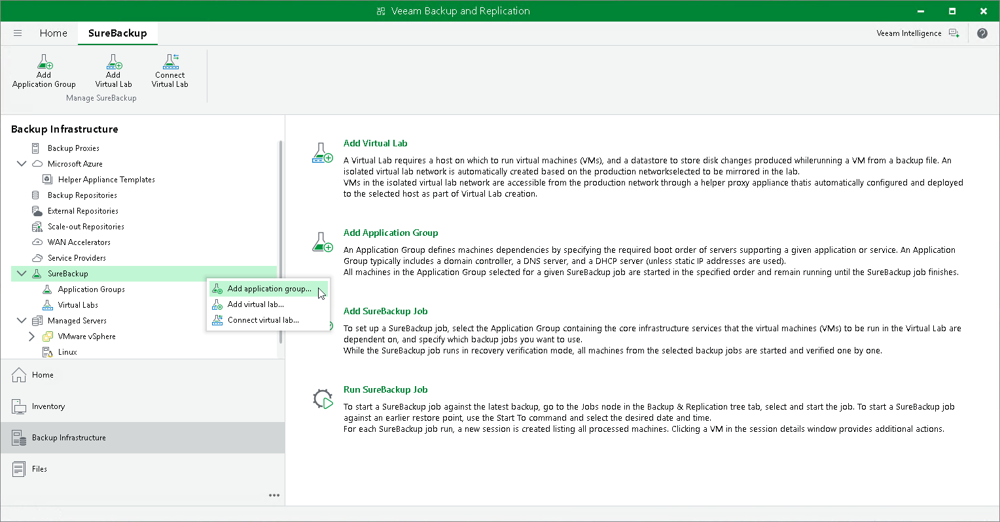

# Step 1. Launch New Application Group Wizard

In this article

To launch the New Application Group wizard, do one of the following:

* Open the Backup Infrastructure view, in the inventory pane select SureBackup. In the working area, click Add Application Group.
* Open the Backup Infrastructure view, in the inventory pane select Application Groups under SureBackup and click Add App Group.
* Open the Backup Infrastructure view, in the inventory pane right-click Application Groups under SureBackup and select Add App Group.

Page updated 9/2/2025

Page content applies to build 13.0.1.1071
