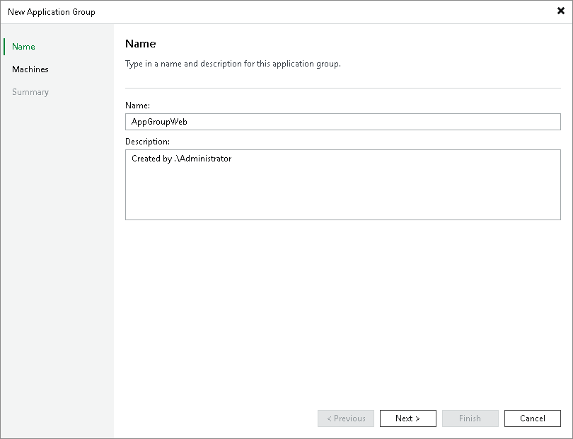

# Step 2. Specify Application Group Name and Description

At the Name step of the wizard, specify a name and description for the application group.

1. In the Name field, enter a name for the application group.
2. In the Description field, provide a description for future reference. The default description contains information about the user who created the group, date and time when the group was created.

