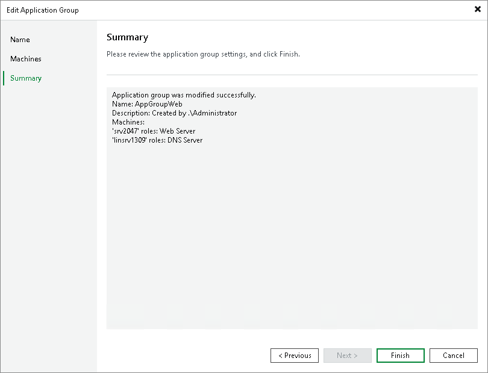

# Step 5. Review the Application Group Settings and Finish Working with Wizard

In this article

At the Summary step of the wizard, complete the procedure of application group configuration.

1. Review details of the application group.
2. Click Finish to save the application group settings and close the wizard.

Page updated 1/25/2024

Page content applies to build 13.0.1.1071
