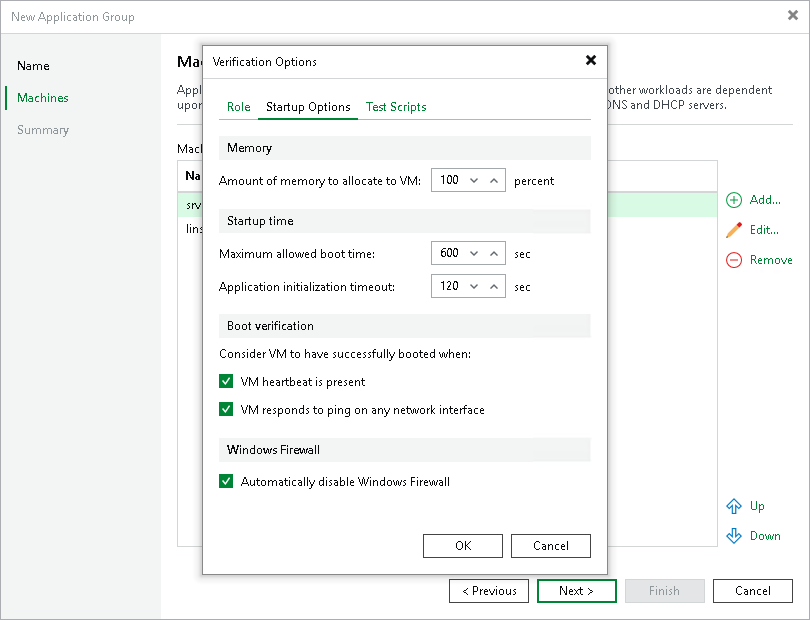
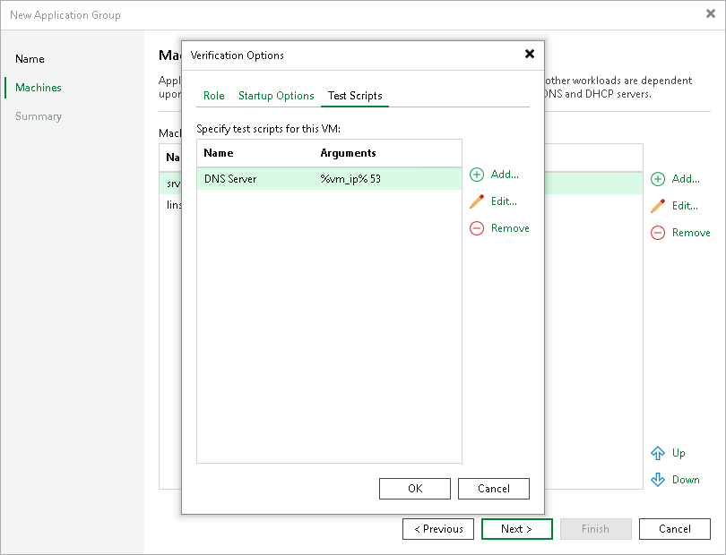
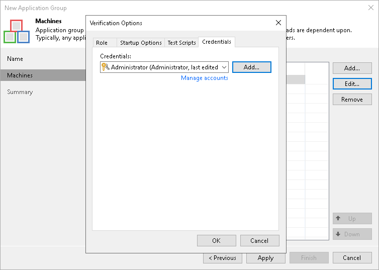

# Step 4. Specify Recovery Verification Options and Tests

In this article

You must specify verification options for every VM in the application group:

* [Select a role that the VM performs](appgroup_tests_vm.md#role).
* [Configure startup settings](appgroup_tests_vm.md#startup).
* [Select tests that must be performed for the VM](appgroup_tests_vm.md#test).
* [For Veeam Backup & Replication on Windows] [Specify credentials for running the verification script](appgroup_tests_vm.md#creds).

To specify recovery verification options:

1. At the Machines step of the wizard, select the machine in the list.
2. Click Edit on the right.
3. Use the Verification Options window to specify verification options.

Role Settings

On the Role tab, select a role that the VM performs. Veeam Backup & Replication offers the following predefined roles for VMs:

* DNS Server
* Domain Controller (Authoritative Restore)

In the Authoritative Restore mode, Veeam Backup & Replication starts a domain controller in the virtual lab and marks it as being authoritative to its replication partners. When other domain controllers (replication partners) are started in the virtual lab, they replicate data from the domain controller started in the Authoritative Restore mode.

* Domain Controller (Non-Authoritative Restore)

In the Non-Authoritative Restore mode, Veeam Backup & Replication restores a domain controller in the virtual lab and marks it as being non-authoritative to its replication partners. Non-authoritative domain controllers then replicate data from a domain controller started in the Authoritative Restore mode.

* Global Catalog
* Mail Server
* [For Veeam Backup & Replication on Windows] SQL Server
* Veeam Backup for Microsoft 365 (machine on which Veeam Backup for Microsoft 365 is installed)
* Web Server

VM roles are described in XML files stored in the %ProgramFiles%\Veeam\Backup and Replication\Backup\SbRoles folder on the backup server. You can create your own roles. To do this, you must create a new XML file and specify role and test scripts settings in it. For more information, see [Creating XML files with VM Roles Description](creating_xml_files.md).

After you select a role for the VM, Veeam Backup & Replication will automatically configure startup options and assign predefined test scripts for the chosen role. You can use these settings or specify custom settings on the Startup Options and Test Scripts tabs.

To verify VMs that perform roles other than those specified in the list, you will have to manually configure startup options and specify test scripts that must be run for these VMs.

|  |
| --- |
| Important |
| If you want to add several domain controllers to the application group, you must assign the Domain Controller (Authoritative Restore) role to the first domain controller started in the virtual lab. Other domain controllers must have the Domain Controller (Non-Authoritative Restore) role. |

Startup Settings

To configure VM startup settings:

1. In the Verification Options window, click the Startup Options tab.
2. In the Memory section, specify the amount of memory that you want to pre-allocate to the VM when this VM starts. The amount of pre-allocated memory is defined in percent. The percentage rate is calculated based on the system memory level available for the production VM. For example, if 1024 MB of RAM is allocated to the VM in the production environment and you specify 80% as a memory rate, 820 MB of RAM will be allocated to the verified VM on startup.

Veeam Backup & Replication does not allow you to change machine CPU manually, it does this automatically. If the VM has more CPU than the host can provide, Veeam Backup & Replication scales down the CPU of the VM.

1. In the Startup time section, specify the Maximum allowed boot time value and the Application initialization timeout value.

Application initialization timeout. Veeam Backup & Replication waits for the applications installed in the VM, for example, Microsoft SQL Server, to start. Depending on the software installed in a VM, the application initialization process may require more time than specified in the job settings. If applications installed in a VM are not initialized within the specified period of time, test scripts can be completed with errors. If such an error situation occurs, you need to increase the Application initialization timeout value and start the job once again.

Maximum allowed boot time. Be careful when specifying the Maximum allowed boot time value. Typically, a VM started by the SureBackup job requires more time to boot than a VM started in the production environment. If VM is not initialized within the specified interval of time, the recovery verification process fails with the timeout error. If such error occurs, you need to increase the Maximum allowed boot time value and run the job again.

1. In the Boot verification section, specify when the VM must be considered to have been booted successfully:

* VM heartbeat is present. If you enable this option, Veeam Backup & Replication will perform a heartbeat test for the verified VM.
* VM responds to ping on any network interface. If you enable this option, Veeam Backup & Replication will perform a ping test for the verified VM.

* Automatically disable Windows Firewall. If you select this option, Veeam Backup & Replication will disable Windows Firewall for the verified VM.

If you enable both heartbeat test and ping test options, Veeam Backup & Replication will require that both tests are completed successfully.

|  |
| --- |
| Note |
| Veeam Backup & Replication performs a heartbeat test only if a VM has VMware Tools installed. If VMware Tools are not installed, the VM will be started but the test will not be performed. VMs without VMware Tools can still be used as auxiliary VMs: they can be started to enable proper work of other machines. In this case, you do not need to select any role for such machines. |

Test Script Settings

When you select a VM role, Veeam Backup & Replication automatically assigns a predefined script which verifies applications inside this VM. The script is launched by the account that controls the Veeam Backup Service. If you want to verify a VM that has some other role not listed on the Role tab:

1. In the Verification Options window, click the Test Scripts tab.
2. Click Add.
3. In the Test Scripts window, select Use the following test script.
4. In the Name field, specify a name for the script.
5. In the Path field, define a path to an executable script file that must be run to verify the VM. You can do one of the following:

* If you have your own custom script, define a path to it in the Path field.
* If you do not have a custom script, you can use a standard utility by Veeam, Veeam.Backup.ConnectionTester.exe, that probes application communication ports. The utility is located in the installation folder of Veeam Backup & Replication: %ProgramFiles%\Veeam\Backup and Replication\Backup\Veeam.Backup.ConnectionTester.exe. Specify this path in the Path field.

1. In the Arguments field, specify an IP address of the verified VM and the port that you want to probe (if the selected test probes the port). You can use the %vm\_ip% variable to define the VM IP address or the %vm\_fqdn% variable to define the VM fully qualified domain name.

For Microsoft SQL Server, you can also specify a path to the log file in the %log\_path% argument. For more information, see [Backup Recovery Verification Tests](surebackup_tests.md).

1. Click OK to add the configured test.

To edit test settings, select the test in the list and click Edit. To delete a test, select the test in the list and click Remove.

|  |
| --- |
| Important |
| Do not pass sensitive information using script arguments in a user interface. |

|  |
| --- |
| Note |
| If a VM performs several roles and runs a number of applications, you can add several verification scripts to verify work of these applications. It is recommended that you specify the maximum startup timeout value and allocate the greatest amount of memory for such VMs. |

Credentials Settings

By default, to run the verification script Veeam Backup & Replication uses the account under which the Veeam Backup Service is running. If you need to run the script under some other account, you can specify credentials for this account in the application group settings.

1. Click the Credentials tab.
2. From the Credentials list, select credentials for the account under which you want to run the script.

If you have not set up credentials beforehand, click the Manage accounts link or click Add on the right to add the credentials. For more information, see [Credentials Manager](credentials_manager.md).

Page updated 11/11/2025

Page content applies to build 13.0.1.1071
