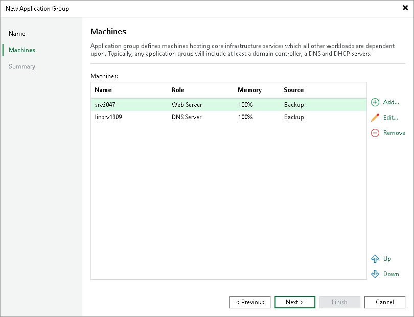

# Step 3. Add Machines to Application Group

At the Machines step of the wizard, add machines to the created application group. You can add machines from different sources:

* Machine backups
* VM replicas
* Storage snapshots

You can add machines from backups, storage snapshots and VM replicas to the same application groups. Keep in mind the following limitations:

* Machines must have at least one valid restore point or must reside on a storage snapshot.
* You cannot add the same machine twice. For example, if you add a machine from the storage snapshot, you will not be able to add the same machine from the backup.

To add machines to the application group:

1. Click Add and select From backups, From replicas or From storage snapshots.
2. In the displayed window, expand the job or storage snapshot, select the machine and click Add.
3. Machines in the list are specified in the order of their boot priority. To move a machine up and down in the list, select it and click Move Up or Move Down.

