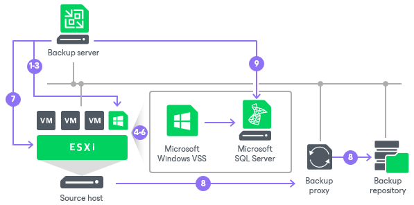

# Application-Aware Processing

By default, Veeam Backup & Replication does not process application logs and creates a crash-consistent backup of VMs with applications that use transaction logs for operations. You can create a transactionally consistent backup — in this case, Veeam Backup & Replication will process application logs. In case a disaster strikes, Veeam Backup & Replication will use backups of logs to perform recovery operations.

To create transactionally consistent backups or replicas of VMs that run the following applications, you must enable application-aware processing in job settings:

* Microsoft Active Directory
* Microsoft SQL Server
* Microsoft SharePoint
* Microsoft Exchange
* Oracle
* PostgreSQL

Application-aware processing is the Veeam technology that allows Veeam Backup & Replication to prepare applications running on the VM and create a consistent view of application data on the VM guest OS. Once the application is ready, Veeam Backup & Replication triggers the VM snapshot and starts to copy VM data to the target. Depending on the VM OS, Veeam Backup & Replication utilizes the following technologies to create transactionally consistent backups:

* For Windows-based VMs, Veeam Backup & Replication uses Microsoft Volume Shadow Copy Service (Microsoft VSS). Microsoft VSS ensures that there are no unfinished database transactions or incomplete application files. For more information, see [Microsoft Docs](https://learn.microsoft.com/en-us/windows-server/storage/file-server/volume-shadow-copy-service).
* For Linux-based VMs, Veeam Backup & Replication uses the agent that connects to the VM guest OS and prepares databases and instances for a consistent backup.

Requirements and Limitations

Application-aware processing is supported for Linux-based VMs and Microsoft Windows client versions starting from Windows Vista and for server versions starting from Windows Server 2008. To use application-aware processing, you must have VMware Tools and the latest updates installed on the VM guest OS. For more information on supported guest OS versions, see [Supported Platforms, Applications and Workloads](platform_support.md#guest).

|  |
| --- |
| Important |
| If a VM runs an application that does not support Microsoft VSS (there is no VSS writer for this particular type of application, for example, MySQL), Veeam Backup & Replication will not be able to utilize Microsoft VSS and application-aware processing for this VM. To process such VMs, you can use VMware Tools quiescence with pre-freeze and post-thaw scripts. For more information, see [VMware Tools Quiescence](tools_quiescence.md) and [Pre-Freeze and Post-Thaw Scripts](pre_post_scripts.md). |

How Application-Aware Processing Works for Windows-Based Machines

If you enable application-aware processing in job settings, Veeam Backup & Replication performs the following operations as a part of the backup or replication process:

1. Veeam Backup & Replication deploys the non-persistent runtime components and security certificates or, if necessary, persistent agent components on the VM and detects if the VM runs any of the supported applications.
2. Veeam Backup & Replication collects information about applications installed on VMs — this information is required for VSS-aware restore.

VSS-aware restore is performed when the VM is started after you restore it from the backup or fail over to a VM replica.

1. Veeam Backup & Replication prepares applications for VSS-aware restore.
2. Microsoft VSS communicates with applications and freezes I/O activities at a specific point in time.
3. Veeam Backup & Replication acts as a VSS requestor and triggers a VM VSS snapshot.
4. Veeam Backup & Replication triggers a VMware vSphere snapshot of the VM.
5. Microsoft VSS resumes frozen I/O activities on the VM guest OS.
6. The job session proceeds as usual.
7. If you have instructed Veeam Backup & Replication to truncate transaction logs, Veeam Backup & Replication truncates transaction logs on the VM guest OS after the backup or replica is successfully created.

How Application-Aware Processing Works for PostgreSQL

If you enable application-aware processing in job settings, Veeam Backup & Replication performs the following operations as a part of the backup or replication process:

1. Veeam Backup & Replication installs either non-persistent components or persistent agent components to the VM guest OS and detects if the VM runs any of the supported applications.

|  |
| --- |
| Note |
| By default, Veeam Backup & Replication installs non-persistent components to the VM guest OS and uninstalls them after the job completes. You can also install a Linux management agent to the VM guest OS — in this case, the agent will remain installed on the VM and Veeam Backup & Replication will use it to access the VM guest OS instead of SSH. For more information, see [Persistent Agent Components](persistent_agent_components.md). |

1. The pgsqlagent agent looks for PostgreSQL instance configuration files. It uses these files to get information on the PostgreSQL instance settings.

|  |
| --- |
| Note |
| By default, configuration files are located in the following directories:   * [For Ubuntu, Debian] — /etc/ * [For RHEL, SLES] — /var/lib/   If you keep the configuration file in the custom directories or if you want to exclude some directories from the scan, you can manually create the /etc/veeam/VeeamPostgreSQLAgent.xml file. In this case, the pgsqlagent agent will use commands from this file. To explicitly include or exclude specific configuration files from rescan, add the following commands to the /etc/veeam/VeeamPostgreSQLAgent.xml file:   * ExcludeConfigDirs — use this command to exclude configuration files. * AddConfigDirs — use this command to include configuration files.   Note that you must embed the commands into the <config /> tag. To specify several directories, separate them by a comma.  For example: <config ExcludeConfigDirs="/etc/postgresql/13/cl4/,/etc/postgresql/13/cl6/" AddConfigDirs="/home/user/pgconfdir/"/>.  This command skips 2 directories and includes 1 custom directory. |

1. The pgsqlagent agent returns a list of PostgreSQL configuration files to Veeam Backup & Replication.
2. Veeam Backup & Replication accesses the PostgreSQL VM guest OS over SSH or over management agent.
3. Veeam Backup & Replication connects to the PostgreSQL instance, gets a list of databases added to the instance and information that is necessary for data recovery operations.
4. The pgsqlagent agent sets the PostgreSQL instance to the ready for a backup state.
5. Agent freezes the VM guest OS and creates a snapshot of the PostgreSQL instance.
6. Veeam Backup & Replication completes a backup of the PostgreSQL instance and resumes stopped activities on the VM guest OS.
7. Veeam Backup & Replication saves a backup of a machine with a PostgreSQL instance to a backup repository.

Related Topics

* [Transaction Log Truncation](transaction_truncation.md)
* [Microsoft SQL Server Log Backup](sql_backup.md)
* [Oracle Log Backup](oracle_backup.md)
* [PostgreSQL WAL Files Backup](postgresql_backup.md)
* [Guest Interaction Proxies](guest_interaction_proxy.md)

