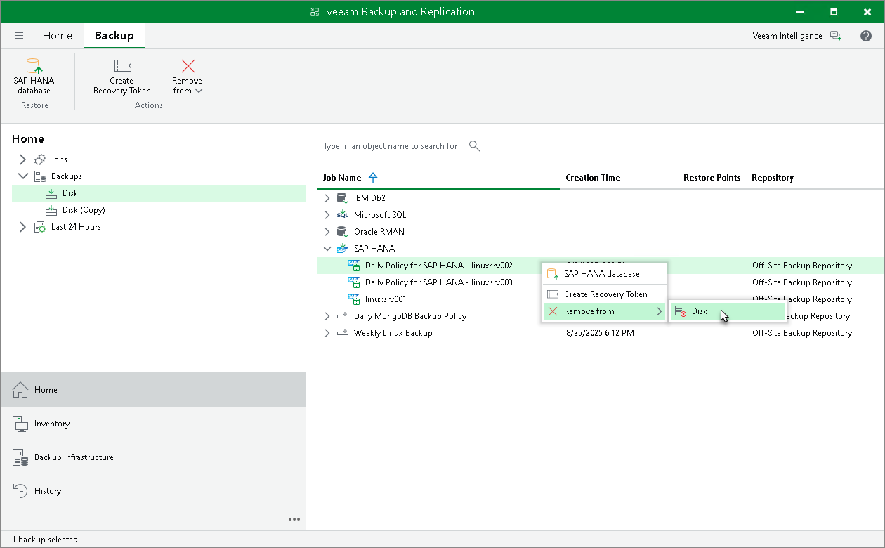

# Deleting Backup from Disk

In this article

If you want to delete records about application backups from the Veeam Backup & Replication console and configuration database and, additionally, delete backup files from the backup repository, you can use the Remove from disk operation.

You can remove specific child backups — backups related to individual computers in the backup.

To remove an application backup from the backup repository:

1. Open the Home view.
2. In the inventory pane, click Backups.
3. In the working area, select the backup and click Remove from > Disk on the ribbon or right-click the backup and select Remove from > Disk.

Page updated 11/4/2025

Page content applies to build 13.0.1.1071
