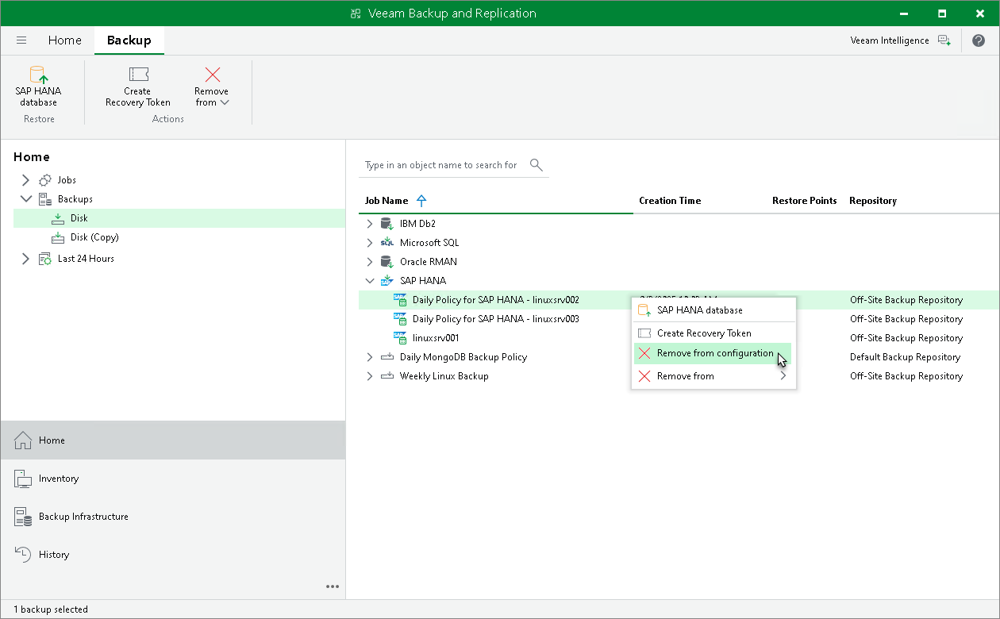

# Removing Backup from Configuration

If you want to remove records about application backups from the Veeam Backup & Replication console and configuration database, you can use the Remove from configuration operation. When you remove an application backup from configuration, the actual backup files remain on the backup repository. You can import the backup to the Veeam Backup & Replication at any time later and restore data from it.

You can remove specific child backups — backups related to individual computers or replica sets in the backup.

|  |
| --- |
| NOTE |
| You can use the Veeam Backup & Replication console to remove backups created by application backup policies in the Veeam backup repository. Backups created on a local drive of a protected computer or in a network shared folder are not displayed in the Veeam backup console. |

To remove an application backup from configuration:

1. Open the Home view.
2. In the inventory pane, click Backups.
3. To remove a backup of a specific computer or replica set in the application backup policy, expand the parent backup, select the necessary computer, press and hold the [Ctrl] key, right-click the backup and select Remove from > Configuration.

