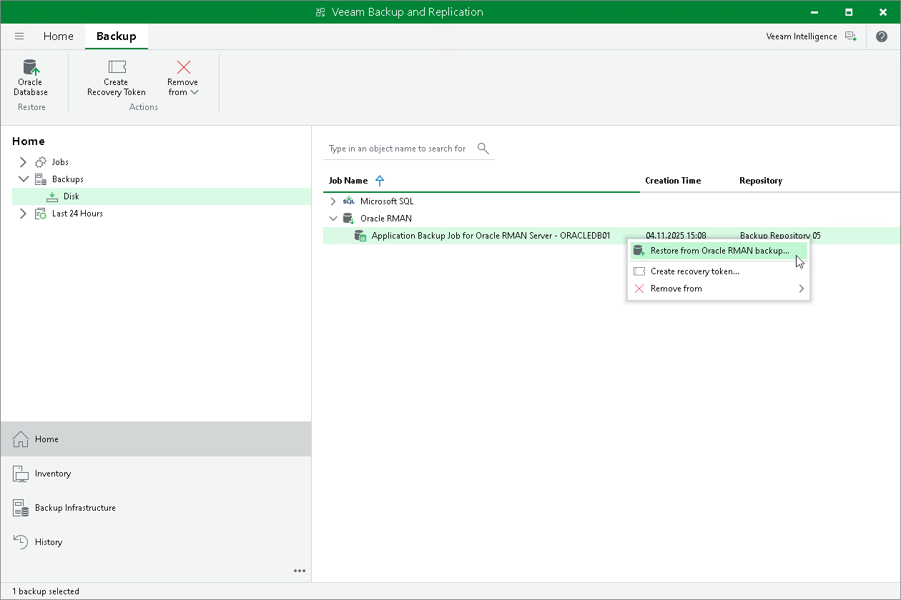

# Restoring from Backup with Veeam Explorer

You can recover SAP HANA, Oracle and Microsoft SQL Server databases from backups created with Veeam Plug-In for SAP HANA, Veeam Plug-In for Oracle RMAN and Veeam Plug-In for Microsoft SQL Server:

* To restore SAP HANA databases, Veeam Backup & Replication uses Veeam Explorer for SAP HANA. For details, see [SAP HANA Data Restore](https://helpcenter.veeam.com/docs/vbr/userguide/vehana_restore.html?ver=13).

Alternatively, to perform restore from SAP HANA databases you can also use Veeam Explorer cmdlets. For details, see the [Veeam Explorer for SAP HANA](https://helpcenter.veeam.com/docs/vbr/explorers_powershell/veeam_explorer_for_sap_hana.html?ver=13) section in the the Veeam Explorers PowerShell Reference.

* To restore Oracle databases, Veeam Backup & Replication uses Veeam Explorer for Oracle. For details, see [Restoring from RMAN Plug-in Backups](https://helpcenter.veeam.com/docs/vbr/userguide/rman_backups.html?ver=13).

Alternatively, to perform restore from Oracle databases you can also use Veeam Explorer cmdlets. For details, see the [Veeam Explorer for Oracle](https://helpcenter.veeam.com/docs/vbr/explorers_powershell/veeam_explorer_for_oracle.html?ver=13) section in the the Veeam Explorers PowerShell Reference.

* To restore Microsoft SQL Server databases, Veeam Backup & Replication uses Veeam Explorer for Microsoft SQL Server. For details, see [Microsoft SQL Server Data Restore](https://helpcenter.veeam.com/docs/vbr/userguide/vesql_data_restore.html?ver=13).

Alternatively, to perform restore from Oracle databases you can also use Veeam Explorer cmdlets. For details, see the [Veeam Explorer for Microsoft SQL Server](https://helpcenter.veeam.com/docs/vbr/explorers/vesql_user_guide.html?ver=13) section in the the Veeam Explorers PowerShell Reference.

Considerations and Limitations

[For Oracle database backup] Before you restore database, consider the following:

* Veeam Explorer for Oracle does not support restore of encrypted Oracle databases.

* [For Solaris OS and IBM AIX] Veeam Explorer for Oracle does not support restore of Oracle databases deployed on Solaris OS and IBM AIX. You can restore Oracle databases on Solaris OS and IBM AIX only with RMAN. For details, see [Restore to Original Server](restore_rman.md).

* If you use huge pages, make sure that you allocated enough memory to the system where you want to restore your database.

Restoring from Backup

To restore database from an application backup:

1. Open the Home view.
2. In the inventory pane, click Backups.
3. In the working area, select one of the following options depending on the backed-up database type:

* [For Oracle database backup] Click Oracle Database on the ribbon or right-click the backup and select Restore from Oracle RMAN backup.
* [For SAP HANA database backup] Click SAP HANA Database on the ribbon or right-click the backup and select Restore from SAP HANA backup.

