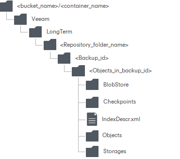

# Archive Extent Structure

When data is transferred to the archive extent, Veeam Backup & Replication creates and maintains the following structure of directories:

| Directory | Description | Misc |
| --- | --- | --- |
| <bucket\_name> or <container\_name> | A bucket or container name.  Buckets and containers must be created in advance. | N/A |
| Veeam/LongTerm/ | Standard folders created by Veeam Backup & Replication. |
| <repository\_folder\_name> | A repository folder that you create when adding a new archive extent. |
| <backup\_id> | Contains objects in a backup. | These folders are automatically removed during data removal. |
| <objects\_in\_backup\_id> | An identifier of an object in a backup. |
| IndexDescr | Contains size of a backup. |
| BlobStore | Contains data blobs created by the archiving session, as described in section [Archive Tier Data Transfer](archive_data_transfer.md). |
| Checkpoints | Contains meta information about the state of archived backup chains. Such meta information is updated upon each successful archiving session. |
| Objects | Contains meta information and other auxiliary data. |  |
| Storages | Contains a replicated version of archived backup files with metadata. |  |

