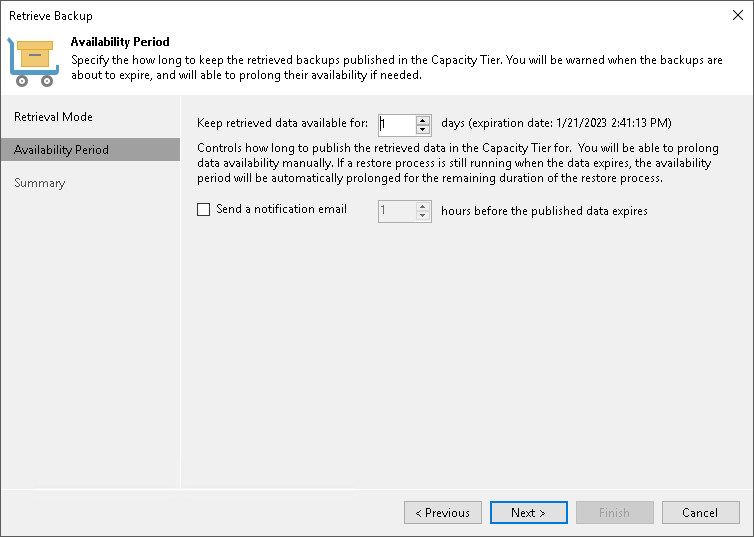

# Step 3. Select Availability Period

In this article

At the Availability Period step of the wizard, select the desired availability period of the retrieved backup files. During that period you will be able to restore the data.

If you want to receive a notification that the availability period is about to end, select the Send a notification email N hours before the published data expires check box and choose the desired time for the notification.

|  |
| --- |
| Tip |
| You will be able to extend that period if necessary. For information on how to extend backup files availability, see [Extending Data Availability](extending_expiration_time.md). |

Page updated 5/29/2024

Page content applies to build 13.0.1.1071
