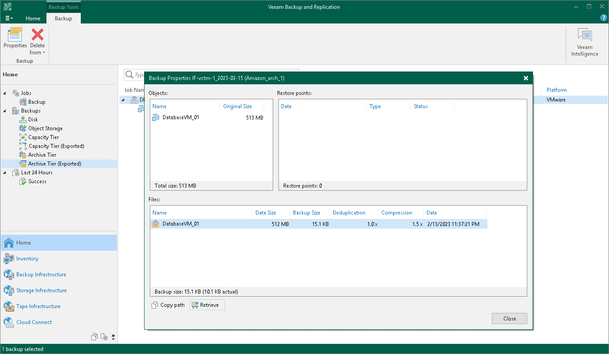

# Step 1. Launch Retrieve Backup Wizard

In this article

To launch the retrieval job, do one of the following:

* Open the Home view. In the [inventory pane](vbr_ui.md) select Archive Tier. In the working area, select the backup job whose files you want to retrieve and click Properties on the ribbon. In the Backup Properties window, click on Retrieve.

* Open the Home view. In the [inventory pane](vbr_ui.md) select Archive Tier. In the working area, select the VM whose guest OS files you want to restore and on the ribbon select the necessary type of restore. Proceed to the Select Restore Point step of the wizard. If this restore point has not been retrieved yet, you will be prompted to launch the Retrieve Backup wizard.

Page updated 12/21/2023

Page content applies to build 13.0.1.1071
