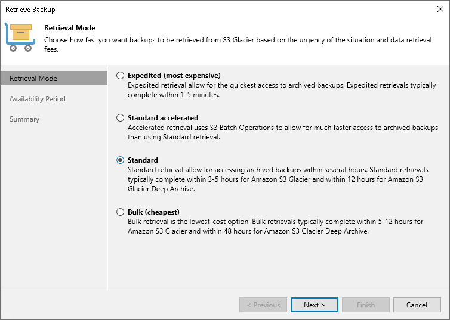

# Step 2. Select Retrieval Mode

In this article

At the Retrieval Mode step of the wizard, select the desired retrieval option. For information on the retrieval modes for different archive storage options, see [Data Retrieval](archive_tier_retrieval.md).

Page updated 11/28/2023

Page content applies to build 13.0.1.1071
