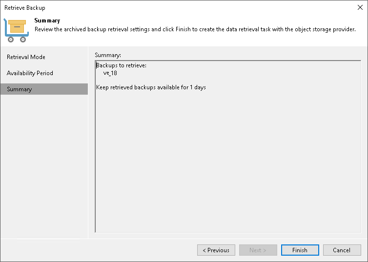

# Step 4. Finish Working with Wizard

In this article

At the Summary step of the wizard, review the retrieval settings. Click Finish to exit the wizard.

Page updated 5/30/2023

Page content applies to build 13.0.1.1071
