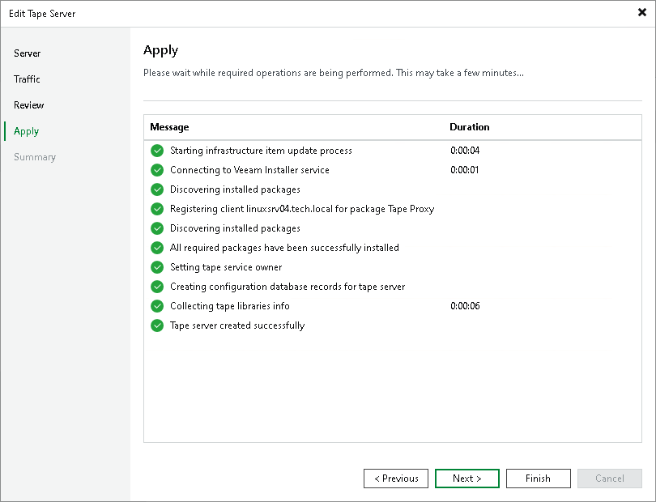

# Step 5. Assess Results

At the Apply step of the wizard, Veeam Backup & Replication will add the tape server to the backup infrastructure in the real time mode.

If Veeam Backup & Replication detects an unknown media changer, the message will appear in the Message area.

