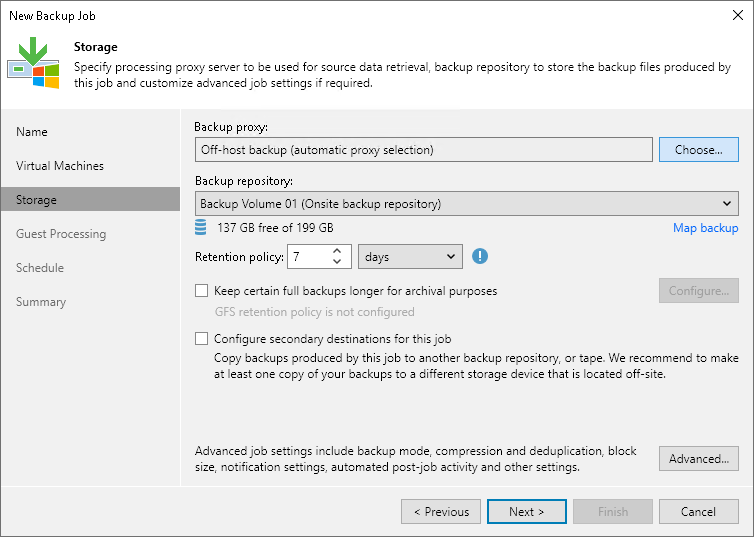
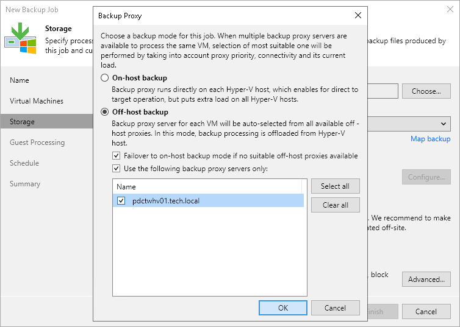

# Assigning Off-Host Backup Proxies to Jobs

In this article

If the automatic proxy detection mechanism does not work correctly, you can manually assign an off-host backup proxy to a job.

1. Open the Home view.
2. In the [inventory pane](vbr_ui.md), select the Jobs node.
3. In the working area, right-click the job and click Edit on the ribbon or right-click the job and select Edit.
4. At the Storage step of the wizard, click Choose next to the Backup proxy field.

1. Select the Use the following backup proxy servers only check box.
2. Select check boxes next to off-host backup proxies you want to use for the job.

When you start the configured job, Veeam Backup & Replication will check the topology scheme of connections for off-host backup proxies that you have selected in the list and choose one of them for the job. If none of these backup proxies can be used for the job and you have selected the Failover to on-host backup mode if no suitable off-host proxies available check box, Veeam Backup & Replication will fail over to the on-host backup mode. If you have not enabled the failover option, the job will fail.

Page updated 12/21/2023

Page content applies to build 13.0.1.1071
