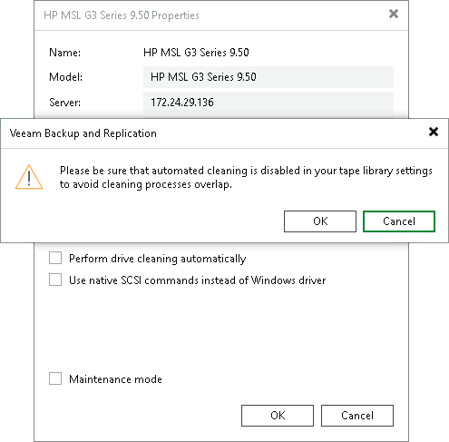

# Automated Drive Cleaning

You can instruct Veeam Backup & Replication to automatically clean the tape library drives.

Assigning the automated cleaning to Veeam Backup & Replication prevents possible overlapping of cleaning tasks and tape jobs. Such overlapping may cause tape jobs failures.

To instruct Veeam Backup & Replication to automatically clean the drives:

1. Open the Tape Infrastructure view.
2. Expand the Libraries node and select the needed library. Click Properties on the ribbon. You can also right-click the necessary library in the working area and select Properties.
3. In the Properties window, select the Perform drive cleaning automatically option.

|  |
| --- |
| Important |
| If you enable the automated drive cleaning option in Veeam Backup & Replication, make sure that you disabled the drive cleaning tasks on your tape library device. |

How It Works

Veeam Backup & Replication cleans the drives at the beginning of backup to tape jobs or file to tape job run. The cleaning is not performed during other tape operations such as, for example, cataloging or export.

To clean the drives automatically, Veeam Backup & Replication performs the following actions:

1. The tape library alerts Veeam Backup & Replication on a drive that requires cleaning.
2. Veeam Backup & Replication waits for a tape job to start.
3. When the tape job locks necessary drives for writing data, Veeam Backup & Replication checks which of them requires cleaning.
4. Veeam Backup & Replication ejects the tape from the drive, inserts a cleaning tape and performs the cleaning.
5. Veeam Backup & Replication ejects the cleaning tape and inserts the tape that was reserved for the tape job.
6. The tape job writes the data on tape.

The cleaning process usually takes several minutes. After the cleaning is done, the [job session statistics](session_results.md) will display a message about the drive cleaning performed.

The cleaning tapes are located in the Unrecognized media pool. You can view the remaining cleaning cycles of each cleaning tape in the Wear field of the Tape Properties window. The worn-out cleaning tapes are moved to the Retired media pool automatically.

If a tape job locks multiple drives simultaneously for parallel processing, and one or more drives require cleaning, all drives wait until the cleaning is finished. After cleaning, all drives start writing simultaneously.

The automated drive cleaning does not affect creation of media sets.

Limitations for Automated Drive Cleaning

Consider the following limitations for automated drive cleaning:

* You cannot enable the automated drive cleaning on standalone tape drives.
* You cannot start the drive cleaning manually with Veeam Backup & Replication. The drive cleaning is fully automated.

