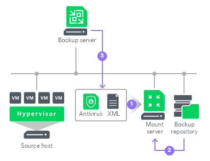

# How Antivirus Scan Works

In this article

During the restore session, the antivirus scan works in the following way:

1. On the mount server, Veeam Backup & Replication runs the Veeam Mount Service to perform the following steps:

1. Mount machine disks from backups to the mount server under the C:\VeeamFLR\<machinename> folder (for Veeam Backup & Replication on Microsoft Windows) or the /run/media/Veeam.Mount.FS/<id> directory (for Veeam Backup & Replication on Linux).
2. Initiate a new scan session.

1. If the antivirus does not detect malware activity, Veeam Backup & Replication will restore the machine or its disks to the target location. The malware detection event will not be created.
2. If the antivirus detects malware activity, Veeam Backup & Replication will perform the following steps:

1. Abort the restore process or restore the machine or its disks with restrictions depending on secure restore settings.

1. Create the malware detection event and mark objects as Infected.

Page updated 11/18/2025

Page content applies to build 13.0.1.1071
