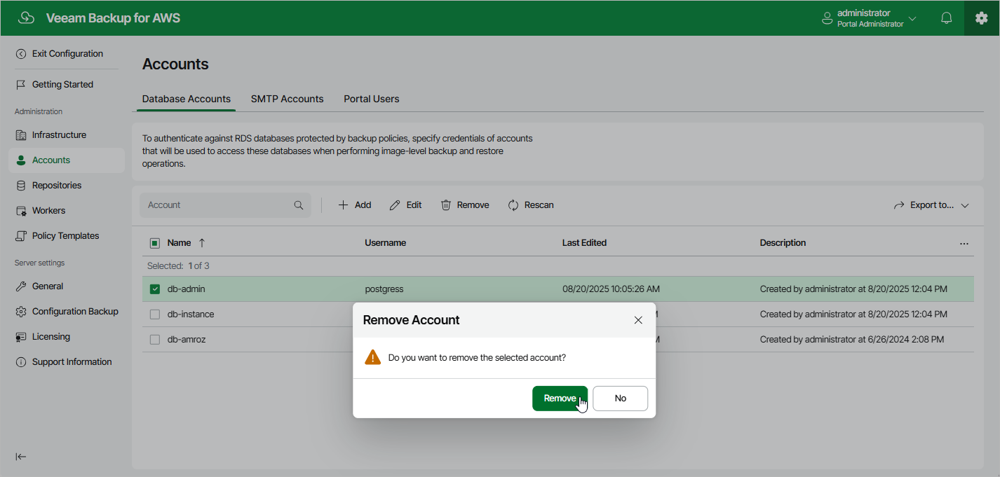

# Removing Database Accounts

The backup appliance allows you to permanently remove a database account from the appliance configuration database if you no longer need it:

1. Switch to the Configuration page.
2. Navigate to Accounts > Database Accounts.
3. Select the account and click Remove.

|  |
| --- |
| Important |
| You cannot remove a database account that is associated with any backup policy. Delete all of the affected policies or [edit their settings](aws_policies_edit.md) — and then try removing the account again. |

Page updated 2026-05-21

