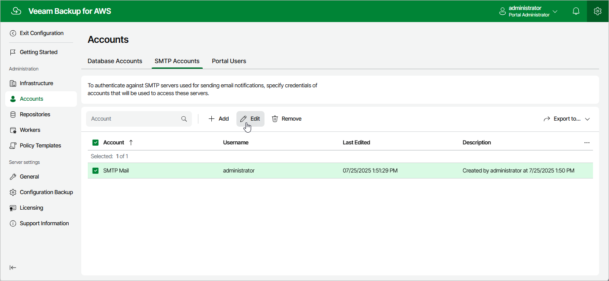

# Editing SMTP Accounts

For each SMTP account, you can modify the settings configured while adding the account:

1. Switch to the
   Configuration
    page.
2. Navigate to
   Accounts
    >
   SMTP Accounts
   .
3. Select the check box next to the necessary SMTP account and click
   Edit
   .

Complete the
Edit Account
 wizard.

1. To provide a new name and description for the account, follow the instructions provided in section
   [Adding SMTP Accounts](aws_accounts_smtp_create.md)
    (step 3a).
2. To specify credentials of another user account to be used to authenticate against the SMTP server, follow the instructions provided in section
   [Adding SMTP Accounts](aws_accounts_smtp_create.md)
    (step 3b).

Page updated 2025-07-25

