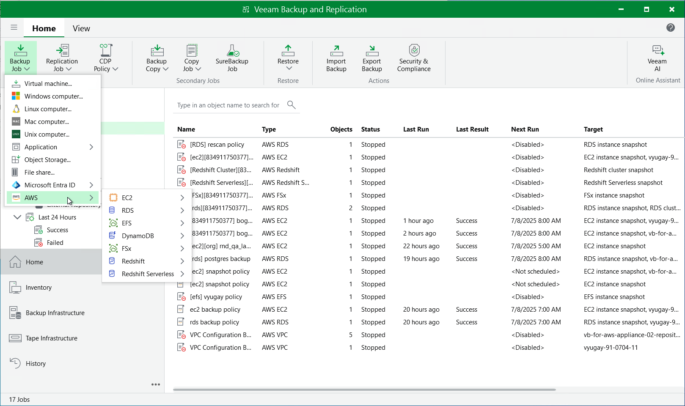

# Creating Backup Policies

You can create backup policies in the backup appliance Web UI only. However, you can launch the Add Policy wizard directly from the Veeam Backup & Replication console — to do that, use either of the following options:

* Switch to the Home tab, click Backup Job on the ribbon, navigate to AWS > EC2, RDS, EFS, DynamoDB, Redshift, Reshift Serverless or FSx and select the backup appliance on which you want to create the backup policy.
* Open the Home view, right-click Jobs, navigate to Backup > AWS > EC2, RDS, EFS, DynamoDB, Redshift, Redshift Serverless or FSx and select the backup appliance on which you want to create the backup policy.

Veeam Backup & Replication will open the Add EC2 Policy, Add RDS Policy, Add EFS Policy, Add DynamoDB Policy, Add Redshift Policy, Add Redshift Serverless Policy or Add FSx Policy wizard in a web browser. Complete the wizard as described in section [Creating EC2 Backup Policies](aws_add_policy_name.md), [Creating RDS Backup Policies](aws_add_policy_name_rds.md), [Creating EFS Backup Policies](aws_add_policy_name_efs.md), [Creating DynamoDB Backup Policies](aws_policies_create_dynamo.md), [Creating Redshift Cluster Backup Policies](aws_policies_create_redshift.md), [Creating Redshift Serverless Backup Policies](aws_policies_create_redshift_serverless.md) or [Creating FSx Backup Policies](aws_policies_create_fsx.md).

|  |
| --- |
| Note |
| Backup appliances come with a preconfigured VPC Configuration Backup policy that is disabled by default. To start protecting your Amazon VPC configuration, you must edit the VPC Configuration Backup policy settings and enable the policy. For more information, see [Editing VPC Configuration Backup Policy](aws_policies_edit_vpc.md). |

Page updated 2026-05-21

