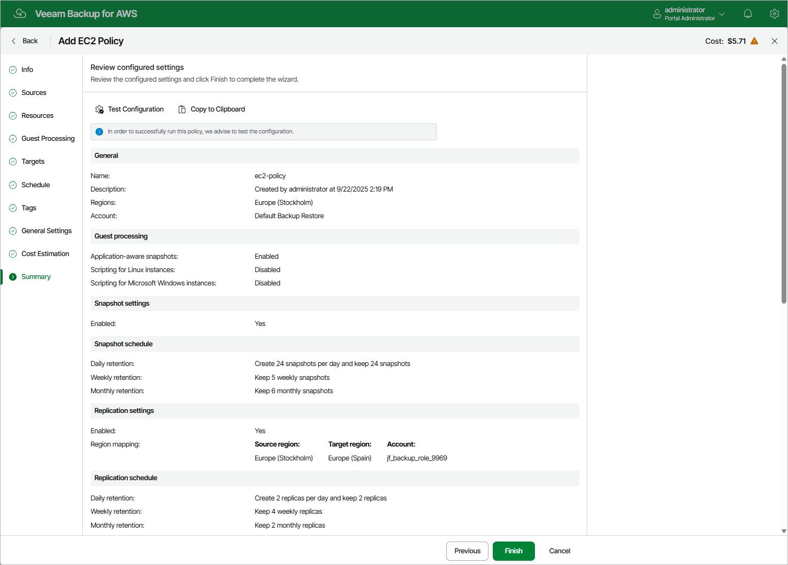

# Step 11. Finish Working with Wizard

At the Summary step of the wizard, it is recommended that you run the backup policy configuration check before you click Finish — to do that, click Test Configuration. Depending on the option selected at [step 3](aws_add_policy_scope.md) of the wizard, the following will happen:

* If you have selected the Account option, the configuration check will verify whether IAM roles specified in the backup policy settings have all the permissions required to perform the backup operation, and whether the configured [network settings](aws_worker_settings.md) allow worker instance deployment.
* If you have selected the Organization option, the configuration check will verify whether IAM roles specified in the [organization settings](aws_organization_add_settings.md) have all the permissions required to perform the backup operation.

The backup appliance will display the Test policy configuration window where you can track the progress and view the results of the configuration check. If some permissions of any IAM role are missing or if the policy settings are not configured properly, the check will complete with errors. You can grant the missing permissions either in the backup appliance Web UI (for IAM roles specified in the backup policy settings) as described in section [Checking IAM Role Permissions](aws_iam_roles_check.md), or in the AWS Management Console (for IAM roles specified in the organization settings) as described in [Appendix B. Creating IAM Policies in AWS](aws_create_iam_policy.md).

|  |
| --- |
| Tip |
| To help you grant missing permissions in the AWS Management Console, the backup appliance allows you to download the full list of these permissions as a single JSON policy document. To do that, click Export Missing Permissions. |

Fixing Network Issues

If the backup policy check reveals that network settings are not configured properly, the backup appliance will not be able to deploy worker instances and thus perform image-level backup.

To fix network issues:

1. Close the Test policy configuration window, and then click Finish to close the Add Policy wizard.

The backup appliance will save the configured backup policy.

1. To prevent the backup policy from failing, disable it. For more information, see [Disabling and Enabling Policies](aws_policies_disable_enable.md#disable).
2. Depending on the error message received after the backup policy check, do the following:

* Make sure that network settings are configured for each AWS Region selected at [step 4b](aws_add_policy_source_settings.md#regions) of the wizard. For information on how to configure network settings for AWS Regions, see [Managing Worker Configurations](aws_worker_settings.md).
* Make sure that VPCs specified in network settings for AWS Regions have access to the required AWS services. The required AWS services are listed in the [Planning and Preparation](aws_planning_and_preparation.md) section.

1. After network issues are fixed, you can enable the backup policy. For more information, see [Disabling and Enabling Policies](aws_policies_disable_enable.md#enable).

Page updated 2026-05-22

