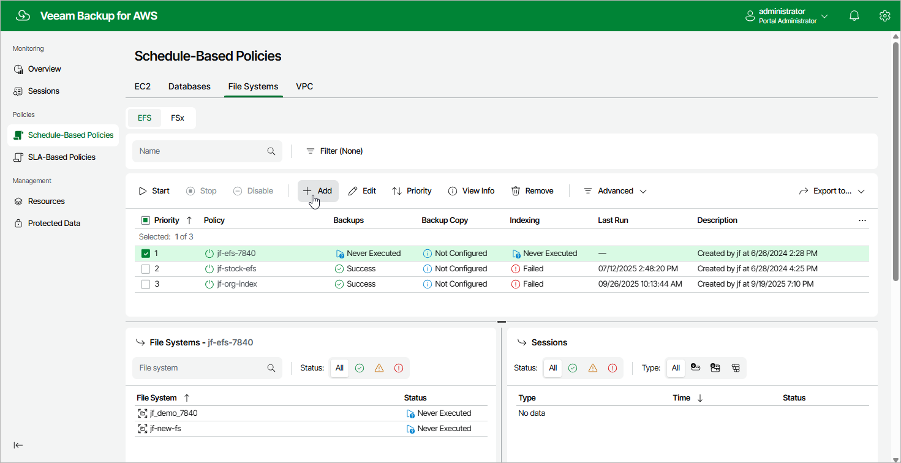

# Step 1. Launch Add EFS Policy Wizard

To launch the
Add EFS Policy
wizard, do the following:

1. Navigate to
   Schedule-Based

   Policies
    >
   File Systems
    >
    EFS
   .
2. Click
   Add
   .

Page updated 2026-01-13

