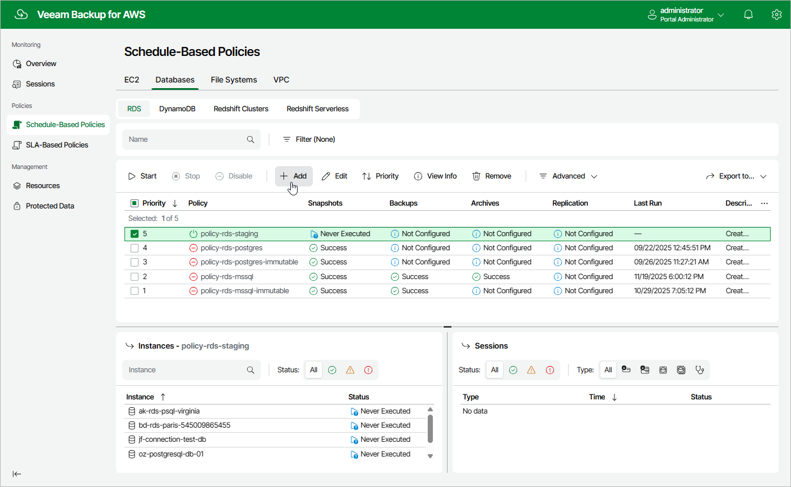

# Step 1. Launch Add RDS Policy Wizard

To launch the
Add RDS Policy
wizard, do the following:

1. Navigate to
   Schedule-Based

   Policies
    >
    Databases
   >
   RDS
   .
2. Click
   Add
   .

Page updated 2026-01-13

