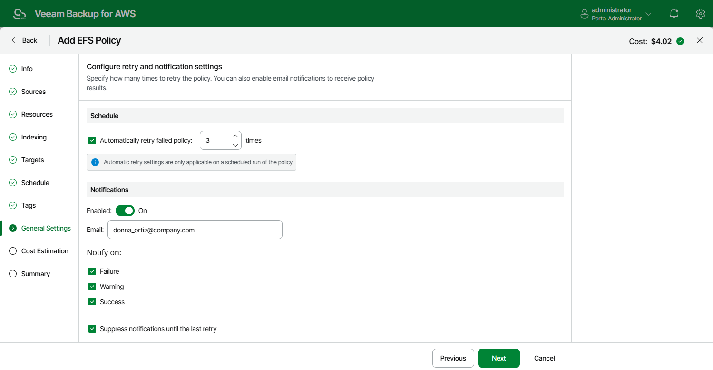

# Step 9. Configure General Settings

At the General Settings step of the wizard, you can enable automatic retries and specify notification settings for the backup policy.

Automatic Retry Settings

To instruct the backup appliance to run the backup policy again if it fails on the first try, do the following:

1. In the Schedule section of the step, select the Automatically retry failed policy check box.
2. In the field to the right of the check box, specify the maximum number of attempts to run the backup policy. The time interval between retries is 60 seconds.

When retrying backup policies, the backup appliance processes only those file systems that failed to be backed up during the previous attempt.

Email Notification Settings

|  |
| --- |
| Note |
| To be able to specify email notification settings for the EFS Backup policy, you must configure [global notification settings](aws_email_settings.md) first. |

To instruct the backup appliance to send email notifications for the backup policy, do the following:

1. In the Notifications section of the step, set the Enabled toggle to On.

If you set the toggle to Off, the backup appliance will send notifications according to the configured global notification settings.

1. In the Email field, specify an email address of a recipient.

Use a semicolon to separate multiple recipient addresses. Do not use spaces after semicolons between the specified email addresses.

1. Use the Notify on list to choose whether you want the backup appliance to send email notifications in case the backup policy completes successfully, completes with warnings or completes with errors.

1. Select the Suppress notifications until the last retry check box to receive a notification about the final backup policy result.

If you do not select the check box, the backup appliance send a notification for every backup policy retry.

|  |
| --- |
| Note |
| If you specify the same email recipient in both backup policy notification and [global notification settings](aws_email_settings.md), the backup appliance will override the configured global notification settings and will send each notification to this recipient only once to avoid notification duplicates. |

Page updated 2026-05-21

