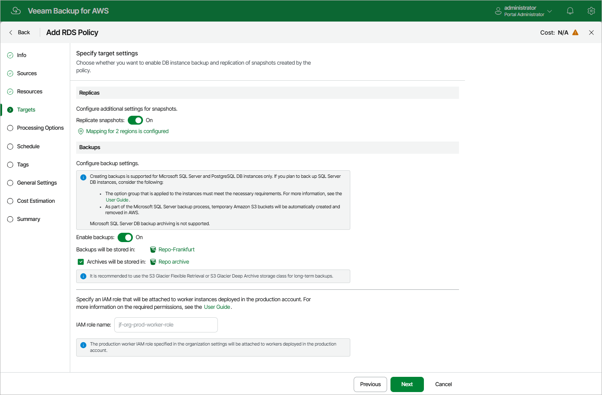

# Configuring Image-Level Backup Settings

In the Backups section of the Targets step of the wizard, you can instruct the backup appliance to create image-level backups of the processed DB instances and to copy backups to a long-term archive storage.

|  |
| --- |
| Note |
| To create RDS image-level backups, the backup appliance deploys worker instances in a production account — that is, the same AWS account to which the processed resources belong. For more information, see [Worker Deployment Options](aws_worker_options.md#production). |

Configuring Backup Settings

To instruct the backup appliance to create image-level backups of the selected RDS resources, do the following:

1. Set the Enable backups toggle to On.
2. In the Repositories window, select a either a backup repository or a storage vault where the created image-level backups will be stored, and click Apply.

For a repository to be displayed in the list of available repositories, it must be added to the backup appliance as described in sections [Adding Backup Repositories](aws_repositories_add_ui.md) and [Adding Storage Vaults Using Console](aws_repositories_add_vault_console.md). The list shows only repositories of the S3 Standard or S3 Standard-IA storage classes.

|  |
| --- |
| Important |
| If you plan to use a storage vault as as the target location, make sure it has the Read-Write status. Otherwise, the backup operation will fail to complete successfully. To learn how to check the storage vault status, see the Veeam Data Cloud User Guide, section [Viewing Vault Assignments](https://helpcenter.veeam.com/docs/vdc/userguide/vault_assignments.html). |

Note that if you have added Microsoft SQL Server DB instances to the backup scope at [step 4](aws_add_policy_source_settings_rds.md) of the wizard, the backup appliance will create a number of temporary Amazon S3 buckets in the same AWS Region in which the processed instances reside and then remove these buckets automatically — but only in case they are not used by any data protection or disaster recovery operations. To learn how the backup appliance creates image-level backups, see [RDS Backup](aws_backup_hiw_rds.md).

Keep in mind that if you have instructed the backup appliance to deploy worker instances without public IPv4 addresses, it must be able to connect to the public s3.<region>.amazonaws.com endpoint to access temporary Amazon S3 buckets. Otherwise, the backup appliance will not be able to create image-level backups of Microsoft SLQ Server DB instances. For more information on the private network deployment functionality, see [Configuring General Settings](aws_enable_private_network_deployment.md).

|  |
| --- |
| Important |
| If you plan to back up Microsoft SQL Server DB instances, consider the following:   * The SQLSERVER\_BACKUP\_RESTORE option must be added to the option group that is applied to each processed DB instance. * The IAM role that is associated with the SQLSERVER\_BACKUP\_RESTORE option must have the permissions required to access temporary Amazon S3 buckets. The IAM role must also have a trust relationship and a permissions policy attached to allow the Amazon RDS service to assume the role.   For more information on the backup and restore option, see [AWS Documentation](https://docs.aws.amazon.com/AmazonRDS/latest/UserGuide/Appendix.SQLServer.Options.BackupRestore.html#Appendix.SQLServer.Options.BackupRestore.Add). |

Configuring Archive Settings

To instruct the backup appliance to store backed-up data in a low-cost, long-term archive storage, do the following:

1. Select the Archives will be stored in check box.
2. In the Repositories window, select a backup repository where the archived data will be stored, and click Apply.

For an archive backup repository to be displayed in the list of available repositories, it must be added to the backup appliance as described in section [Adding Backup Repositories](aws_repositories_add_ui.md). The list shows only backup repositories of the S3 Glacier Flexible Retrieval or S3 Glacier Deep Archive storage classes.

For more information on backup archiving, see [Enabling Backup Archiving](aws_backup_archiving_rds.md).

|  |
| --- |
| Important |
| * For Microsoft SQL Server DB instances, the backup appliance does not support storing backed-up data in long-term archive storage. * If you enable backup archiving, consider that data encryption must be either enabled or disabled for both backup and archive backup repositories. This means that, for example, you cannot select an encrypted standard backup repository and an unencrypted archive backup repository in one backup policy. However, the selected repositories can have different encryption schemes (password and KMS encryption). |

Configuring Worker Settings

Depending on the option selected at [step 3](aws_add_policy_scope_rds.md) of the wizard, the following will happen:

* If you have selected the Account option, you will be able to choose an IAM role that will be attached to the worker instances and used by the backup appliance to communicate with these instances. The role you choose must belong to the same account to which the IAM role specified for the backup operation belongs, and must be assigned the permissions listed in section [Worker Deployment Role Permissions in Production Accounts](aws_role_permissions_prod_acc.md#worker_reqs).

For an IAM role to be displayed in the list of available roles, it must be added to the backup appliance with the Production worker role selected as described in section [Adding IAM Roles](https://helpcenter.veeam.com/docs/vbaws/guide/iam_roles_add.html). If you have not added the necessary IAM role to the backup appliance beforehand, you can do it without closing the Add Policy wizard. To do that, click Add and complete the Add IAM Role wizard.

* If you have selected the Organization option, the backup appliance will automatically choose an IAM role that will be attached to the worker instances and used by the backup appliance to communicate with these instances. It will be one of the roles specified in the settings of the selected organization identity — either the IAM role whose permissions will be used to perform the backup operation (that is, the Backup and restore IAM role), or the IAM role that will be attached to the worker instances and used by the backup appliance to communicate with these instances (that is, the Production worker IAM role).

For the backup appliance to be able to choose an IAM role automatically, it must be created in all AWS accounts belonging to the selected organization identity, and specified in the organization settings as described in section [Adding AWS Organizations](aws_organization_add_settings.md#backup_role) (step 3).

In both cases, you will have to assign additional permissions to the IAM role that will be used to perform the backup operation. For more information on the required permissions, see section [RDS Backup IAM Role Permissions](aws_role_permissions_backup_rds.md).

|  |
| --- |
| Important |
| If you select the Account option, it is recommended that you check whether both the IAM role specified at [step 3](aws_add_policy_scope_rds.md#account) of the wizard and the IAM role specified in the Backups section have the required permissions. If some permissions of the IAM role are missing, the backup policy may fail to complete successfully. To run the IAM role permission check, click Check Permissions and follow the instructions provided in section [Checking IAM Role Permissions](aws_iam_roles_check.md#wizard). |

Worker Instance Requirements

To perform RDS image-level backups, the backup appliance deploys worker instances in production accounts in the same AWS Regions and VPCs in which processed PostgreSQL DB instances reside. By default, the backup appliance uses the most appropriate network settings of AWS Regions in production accounts to deploy worker instances. However, you can add [specific worker configurations](aws_worker_add_config_prod.md) to specify network settings for each region in which worker instances will be deployed.

If no [specific worker configurations](aws_worker_add_config_prod.md) are added to the backup appliance, the most appropriate network settings of AWS Regions are used to deploy worker instances for the RDS backup operation. For the backup appliance to be able to deploy a worker instance used to create an image-level backup:

* The DNS resolution option must be enabled for the VPC network. For more information, see [AWS Documentation](https://docs.aws.amazon.com/vpc/latest/userguide/working-with-vpcs.html#Create-VPC).
* As the backup appliance uses public access to communicate with worker instances, the [public IPv4 addressing](https://docs.aws.amazon.com/vpc/latest/userguide/subnet-public-ip.html) attribute must be enabled at least for one subnet in the Availability Zone where the DB instance resides and the VPC network to which the subnet belongs must have an [internet gateway attached](https://docs.aws.amazon.com/vpc/latest/userguide/VPC_Internet_Gateway.html). VPC network and subnet route tables must have routes that direct internet-bound traffic to this internet gateway.

If you want worker instances to operate in a private network, enable the [private network deployment](aws_enable_private_network_deployment.md) functionality and configure [specific VPC endpoints](aws_configuring_private_networks.md) for the subnet to let the backup appliance use private IPv4 addresses. Alternatively, configure VPC interface endpoints as described in section [Appendix C. Configuring Endpoints in AWS](aws_configure_endpoints.md).

|  |
| --- |
| Note |
| During RDS image-level backup operations, the backup appliance creates 2 additional security groups that are further associated with the source DB instances and worker instances to allow direct network traffic between them. To learn how RDS resource backup works, see [RDS Backup](aws_backup_hiw_rds.md). |

Page updated 2026-06-03

