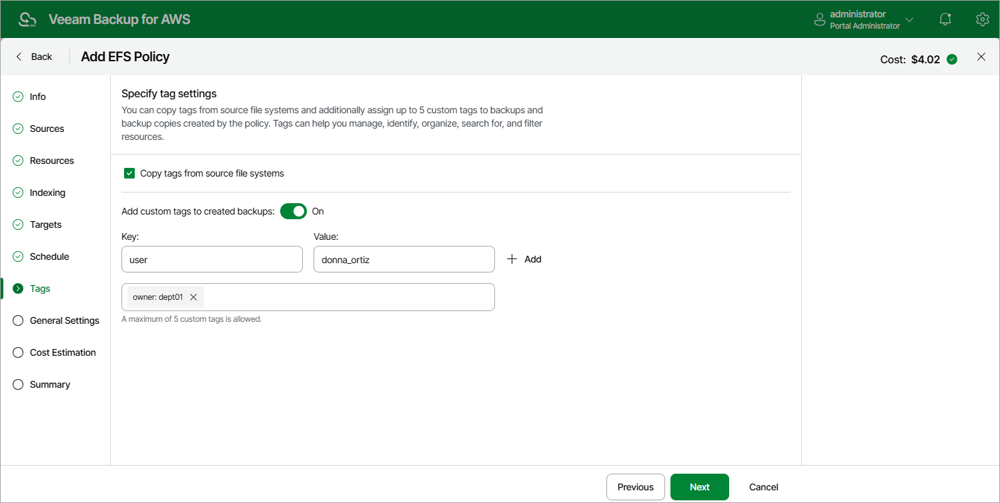

# Step 8. Enable AWS Tags Assignment

At the
Tags
step of the wizard, you can choose whether you want to assign to backups and backup copies of the selected EFS file systems already existing AWS tags and your own custom tags.

If you set the
Add custom tags to created backups
toggle to
On
, you must also specify the tags explicitly. To do that, use the
Key
and
Value
fields to specify a key and a value for the new custom AWS tag, and then click
Add
. Note that you cannot add more than 5 custom tags.

Page updated 2025-11-24

