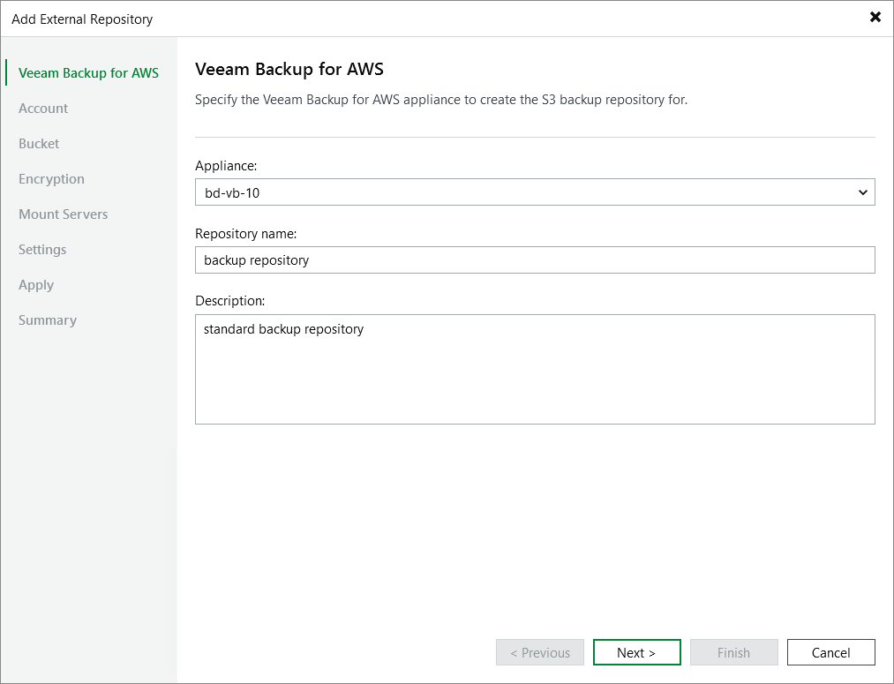

# Step 2. Specify Repository Details

At the
Veeam Backup for AWS
step of the wizard, do the following:

1. From the
   Appliance
    drop-down list, select a backup appliance that will manage the repository.

For an appliance to be displayed in the
Appliance
 drop-down list, it must be added to the backup infrastructure as described in section
[Deploying Backup Appliance](aws_deploying_appliances.md)
 or
[Connecting to Existing Appliances](aws_connect_appliance.md)
.

1. Use the
   Repository name
    and
   Description
    fields to enter a name for the new repository and to provide a description for future reference. The maximum length of the name is 125 characters; the following characters are not supported: \ / " ' [ ] : | < > + = ; , ? \* @ & \_ .

Veeam Backup & Replication
 will create a folder with the specified name in the storage bucket that you will specify at the
[step 5](aws_add_s3_bucket.md)
 of the wizard. This folder will be used to store backed-up data.

Page updated 2026-01-29

