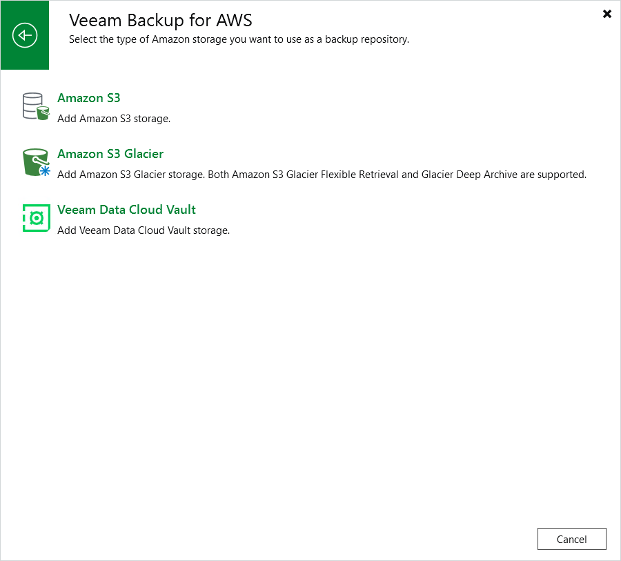

# Step 1. Launch Add External Repository Wizard

To launch the Add External Repository wizard, do the following:

1. In the Veeam Backup & Replication console, open the Backup Infrastructure view.
2. Navigate to External Repositories and click Add Repository on the ribbon.

Alternatively, you can right-click the External Repositories node and select Add.

1. In the Add External Repository window, click Veeam Backup for AWS and select either of the following options:

* Select the Amazon S3 option if you want to create a repository with the S3 Standard or S3 Standard-IA storage class assigned.
* Select the Amazon S3 Glacier option if you want to create a repository with the S3 Glacier Flexible Retrieval or S3 Glacier Deep Archive storage class assigned.

Page updated 2026-07-13

