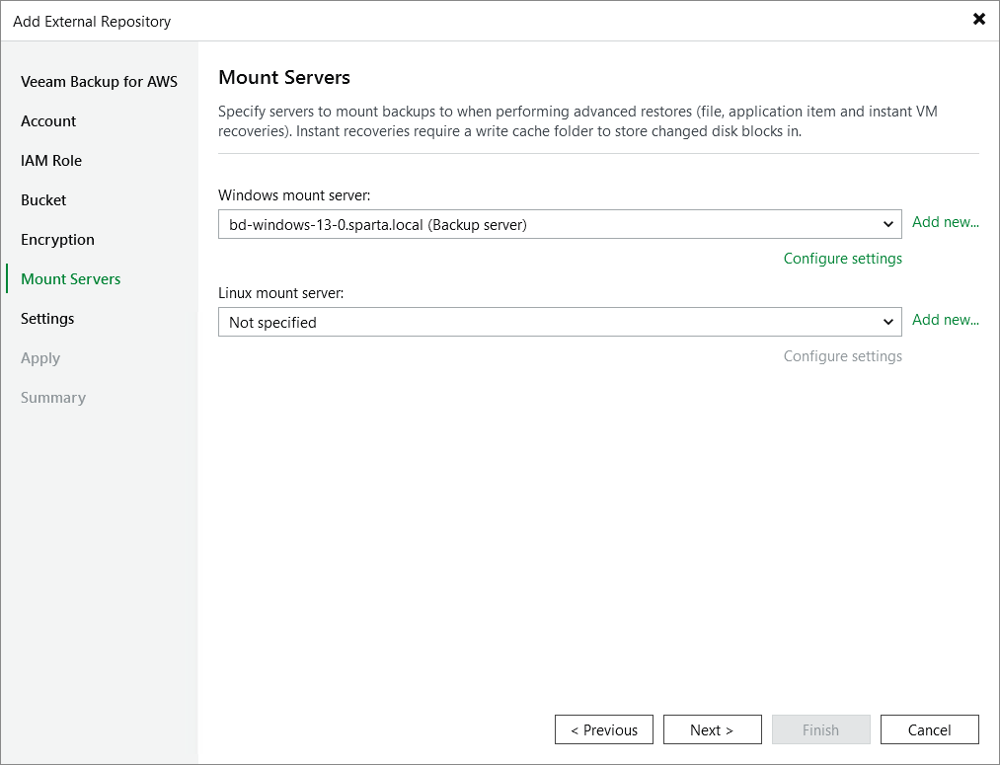

# Step 7. Specify Mount Server Settings

[This step applies only if you plan to perform Instant Recovery, guest OS file restore and application item restore operations]

At the Mount Servers step of the wizard, you can specify servers that will be used to mount backed-up EC2 instance volumes and copy data to restore locations. Windows mount servers are required to restore data from Windows EC2 instances and Linux mount servers are required to restore data from Linux EC2 instances.

By default, Veeam Backup & Replication automatically selects the server where Veeam Backup & Replication is deployed as the mount server of the same operating system. For the other operating system, Veeam Backup & Replication selects a server from your backup infrastructure (if any) that meet the [system requirements](system_requirements.md). However, you can also specify servers manually. To do that, select the necessary servers from the lists of available mount servers. For a server to be displayed in the Windows mount server or the Linux mount server list, it must be added to the backup infrastructure as described in Veeam Backup & Replication User Guide, section [Adding Microsoft Windows Servers](add_windows_server_console.md) or [Adding Linux Servers](add_linux_server_console.md). If you have not added the server to Veeam Backup & Replication beforehand, you can do it without closing the Add External Repository wizard. To do that, click Add new and complete the New Server wizard.

If you plan to use Instant Recovery or scan backups with SureBackup in VMware vSphere environments, you must specify additional settings. To do that, click Configure settings. In the Mount Server Settings window, do the following:

1. Select the Enable vPower NFS service on the mount server. The [Veeam vPower NFS Service](vpower_nfs_service.md) publishes backups to the ESXi host as an NFS datastore, allowing you to perform Instant Recovery of any backup (physical, virtual or cloud) to a VMware vSphere VM.

To customize network ports used by the Veeam vPower NFS Service, click Ports. By default, the service uses port 1058 to mount the vPower NFS datastore to the ESXi host and port 2049 to connect to the target NFS share.

|  |
| --- |
| Important |
| It is not recommended that you run Microsoft Windows NFS services and Veeam vPower NFS Service on the same mount server. Otherwise, both services may fail to work properly. |

1. [Applies only if you plan to perform Instant Recovery] In the Instant recovery write cache folder field, specify a folder on the mount server that will be used to store changed volume blocks of EC2 instances recovered during Instant Recovery. Make sure the disk that contains this folder has enough free space for these blocks.

Related Topics

* [Verifying Backups](aws_verify_backups.md)
* [Instant Recovery](aws_instant_recovery.md)
* [Performing Guest OS File Restore](aws_guest_file_recovery.md)
* [Performing Application Item Restore](aws_application_items_restore.md)

Page updated 2026-07-31

