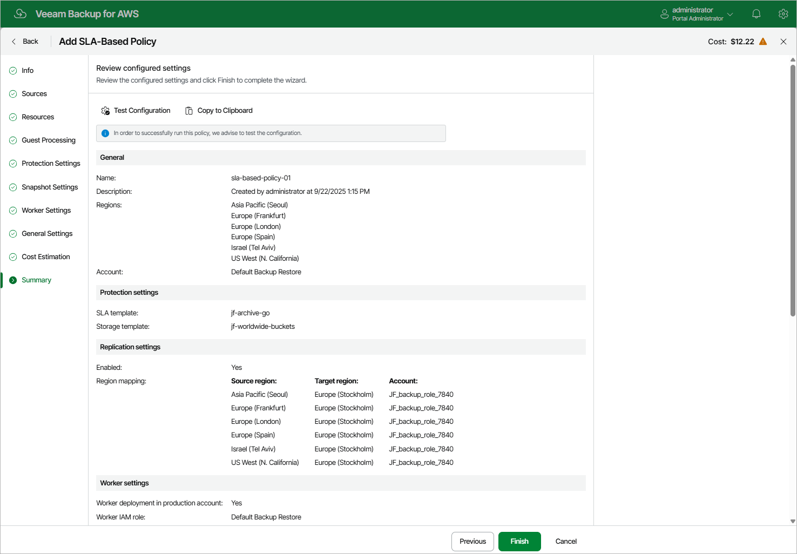

# Step 11. Finish Working with Wizard

At the Summary step of the wizard, it is recommended that you run the backup policy configuration check before you click Finish — to do that, click Test Configuration. Depending on the option selected at [step 3](aws_add_policy_scope.md) of the wizard, the following will happen:

* If you have selected the Account option, the configuration check will verify whether IAM roles specified in the backup policy settings have all the permissions required to perform the backup operation.
* If you have selected the Organization option, the configuration check will verify whether IAM roles specified in the [organization settings](aws_organization_add_settings.md) have all the permissions required to perform the backup operation.

The backup appliance will display the Test policy configuration window where you can track the progress and view the results of the configuration check. If some permissions of any IAM role are missing or if the policy settings are not configured properly, the check will complete with errors. You can grant the missing permissions either in the backup appliance Web UI (for IAM roles specified in the backup policy settings) as described in section [Checking IAM Role Permissions](aws_iam_roles_check.md), or in the AWS Management Console (for IAM roles specified in the organization settings) as described in [Appendix B. Creating IAM Policies in AWS](aws_create_iam_policy.md).

|  |
| --- |
| Tip |
| To help you grant missing permissions in the AWS Management Console, the backup appliance allows you to download the full list of these permissions as a single JSON policy document. To do that, click Export Missing Permissions. |

Page updated 2026-05-21

