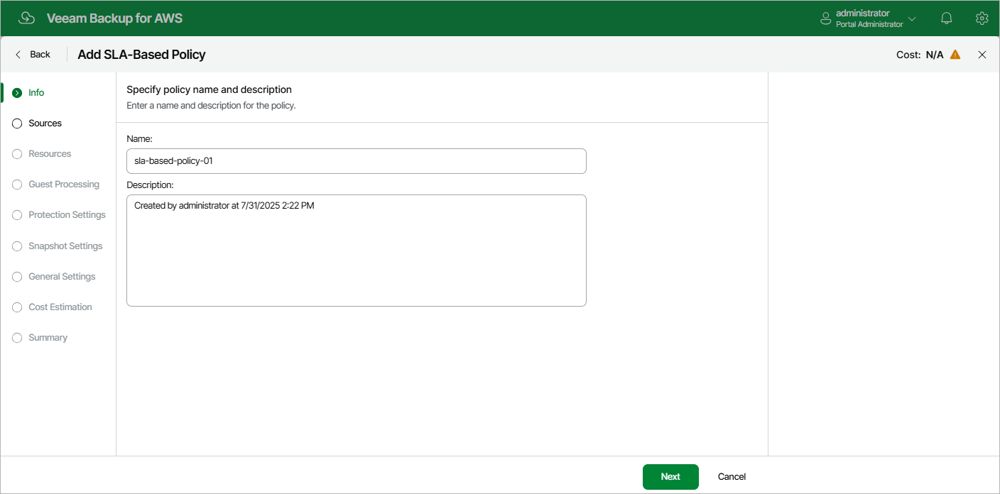

# Step 2. Specify Policy Name and Description

At the Info step of the wizard, enter a name for the new backup policy and provide a description for future reference. The name must be unique in the backup appliance; the maximum length of the name is 127 characters, the maximum length of the description is 255 characters.

Page updated 2026-05-21

