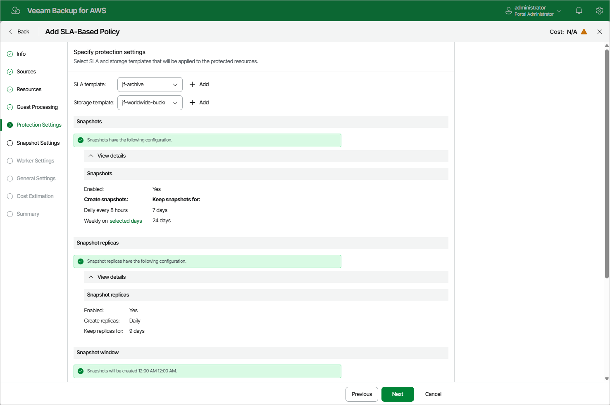

# Step 6. Specify Protection Settings

At the Protection Settings step of the wizard, select an SLA and a storage template that will be assigned to the policy:

1. From the SLA template list, select an SLA template whose snapshot, snapshot replica, backup and archived backup settings the policy will use to protect EC2 instances specified at [step 4](aws_add_sla_policy_source_settings.md#resources) of the wizard.

For an SLA template to be displayed in the list, it must be added to the backup appliance as described in section [Adding SLA Templates](aws_sla_add.md). If you have not added the necessary SLA template to the backup appliance beforehand, you can do it without closing the SLA-Based Policy wizard. To do that, click Add and complete the Add SLA Template wizard.

|  |
| --- |
| Note |
| If you create the backup policy during active data protection windows configured for the selected SLA template, the backup appliance will run the policy immediately after it is created. |

1. From the Storage template list, select a storage template whose target location settings the policy will use to store backed-up data.

For a storage template to be displayed in the list, it must be added to the backup appliance as described in section [Adding Storage Templates](aws_storage_add.md). If you have not added the necessary storage template to the backup appliance beforehand, you can do it without closing the SLA-Based Policy wizard. To do that, click Add and complete the Add Storage Template wizard.

|  |
| --- |
| Important |
| The backup and archived backup settings configured for the selected SLA template must match the target location settings configured for the selected storage template. That is, if backups are configured for the selected SLA template, make sure you configured backup location settings for the storage template, and if archive backups are configured for the selected SLA template, make sure you configured archived backup location settings for the storage template. |

Page updated 2026-05-21

