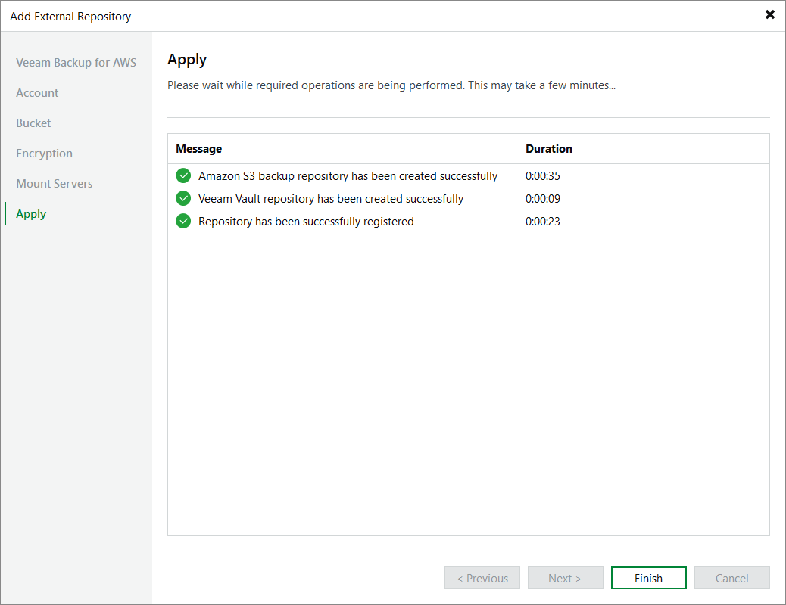

# Step 7. Track Progress

Veeam Backup & Replication will display the results of every step performed while creating the storage vault. At the Apply step of the wizard, wait for the process to complete and click Next.

Page updated 2026-07-09

