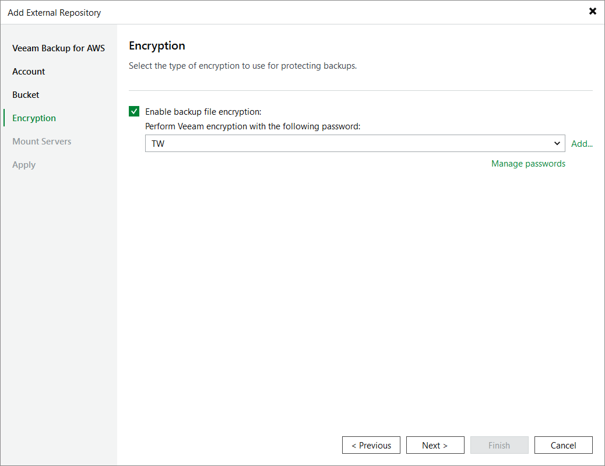

# Step 5. Enable Data Encryption

At the Encryption step of the wizard, choose whether you want to encrypt backups stored in the created storage vault using a password and select the necessary password from the drop-down list.

For a password to be displayed in the list of available passwords, it must be added to Veeam Backup & Replication as described in section [Creating Passwords](password_manager_create.md). If you have not added the necessary password beforehand, you can do it without closing the wizard. To do that, click either the Manage passwords link or the Add button, and specify the password and hint in the Password window.

|  |
| --- |
| Important |
| After you create a storage vault with encryption enabled, you can no longer disable encryption for this vault. However, you will be able to change the encryption settings as described in section [Editing Repository Settings](aws_repositories_edit.md). |

Page updated 2026-06-30

