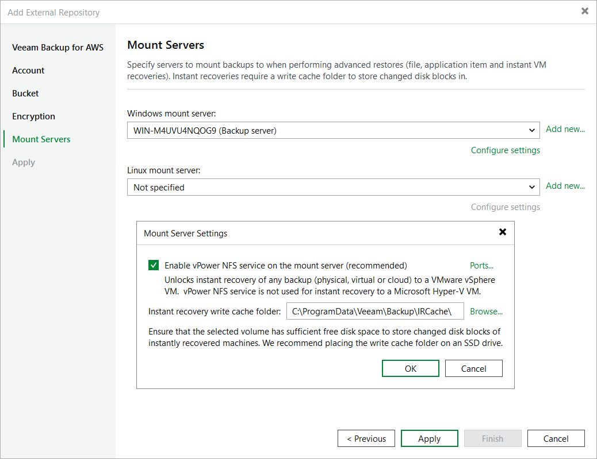

# Step 6. Specify Mount Server Settings

[This step applies only if you plan to perform Instant Recovery, guest OS file restore or application item restore operations]

At the Mount Servers step of the wizard, you can specify servers that will be used to mount volumes of protected EC2 instances and to copy backed-up data to restore locations. By default, these servers are selected automatically depending on the operating system of the server where Veeam Backup & Replication is deployed and on the list of servers added to your backup infrastructure; however, you can also specify the servers manually. To do the latter, use the Windows mount server and Linux mount server drop-down list — a Windows mount server is required to restore data of Windows EC2 instances, while a Linux mount server is required to restore data from Linux EC2 instances.

For a server to be displayed in the list of available mount servers, it must be added to the backup infrastructure as described in section [Adding Microsoft Windows Servers](add_windows_server_console.md) or [Adding Linux Servers](add_linux_server_console.md). If you have not added the server to Veeam Backup & Replication beforehand, you can do it without closing the Add External Repository wizard. To do that, click Add new and complete the New Server wizard.

|  |
| --- |
| Important |
| When specifying mount servers manually, keep in mind that these servers must meet the system requirements listed in section [Planning and Preparation](system_requirements.md). |

If you plan to perform guest OS file restore or application item restore operations, no additional configuration is required. However, if you plan to perform Instant Recovery or verify backups with SureBackup in VMware vSphere environments, you must configure the following settings for each of the specified mount servers:

* [For SureBackup, you must enable the vPower NFS service service only](#nfs_service)
* [For Instant Recovery, you must both enable the vPower NFS service and specify a folder that will be used to store changed volume blocks of EC2 instances](#caxhe_folders)

Enabling vPower NFS Service

The Veeam vPower NFS Service is a Microsoft Windows or Linux service that allows a machine to act as an NFS server — Veeam Backup & Replication installs the service, creates a specific directory (that is, a vPower NFS datastore) on the machine, and mounts this directory to the target ESXi host. As a result, the host becomes able to access backed-up VM images. For more information, see [Veeam Backup & Replication Services](vpower_nfs_service.md).

To instruct Veeam Backup & Replication to install the Veeam vPower NFS Service on a mount server, do the following:

1. Click Configure settings.
2. In the Mount Server Settings window, select the Enable vPower NFS service on the mount server check box.

By default, the service uses ports 1058 and 2049 to establish a connection between the vPower NFS datastore and the target ESXi host. However, you can also customize the ports manually — to do that, click Ports.

|  |
| --- |
| Important |
| It is recommended that you do not run Microsoft Windows NFS services on the same machine where the Veeam vPower NFS Service is installed. Otherwise, both services may fail to work properly. |

Specifying Cache Folders

During Instant Recovery, the backup image of an EC2 instance remains read-only to avoid unexpected modifications. By default, all changes made to the instance volumes are saved in a specific folder on a mount server (that is, /var/lib/veeamdata/veeam/IRCache/ folder). However, you can also specify a folder manually — to do that, click Browse. Make sure the mount server disk that contains this folder has enough free space for these blocks.

Related Topics

* [Verifying Backups](aws_verify_backups.md)
* [Instant Recovery](aws_instant_recovery.md)
* [Performing Guest OS File Restore](aws_guest_file_recovery.md)
* [Performing Application Item Restore](aws_application_items_restore.md)

Page updated 2026-08-03

