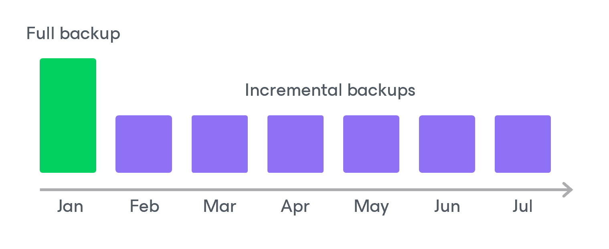

# Archive Backup Chain

If you enable backup archiving for a backup policy, the backup appliance creates a new backup in an archive backup repository during every archive session according to the backup policy schedule. A sequence of backups created during a set of archive sessions makes up an archive backup chain.

The archive backup chain includes backup files of the following types:

* Full — a full archive backup stores a copy of the full EC2 instance image.
* Incremental — incremental archive backups store incremental changes of the EC2 instance image.

To create an archive backup chain for a EC2 instance protected by a backup policy, the forever forward incremental backup method is implemented:

1. During the first archive session, the backup appliance detects backed-up data that is stored in the full backup and all incremental backups existing in the [standard backup chain](aws_backup_chain.md), creates a full archive backup with all the data, and copies this backup to the archive backup repository. The full archive backup becomes a starting point in the archive chain.
2. During subsequent archive sessions, the backup appliance checks the standard backup chain to detect data blocks that have changed since the previous archive session, creates incremental archive backups with only those changed blocks, and copies these backups to the archive backup repository. The content of each incremental archive backup depends on the content of the full archive backup and the preceding incremental archive backups in the archive backup chain.

Full and incremental archive backups act as restore points for backed-up EC2 instances that let you roll back instance data to the necessary state. To recover an EC2 instance to a specific point in time, the chain of backups created for the instance must contain a full archive backup and a set of incremental archive backups.

If some backup in the archive backup chain is missing, you will not be able to roll back to the necessary state. For this reason, you must not delete individual files from the archive backup repository manually. Instead, you must specify retention policy settings that will let you maintain the necessary number of backups in the archive backup repository. For more information, see [Retention Policy for Archived Backups](aws_retention_archive.md).

|  |
| --- |
| Note |
| If you change the backup repository in a schedule-based backup policy or in a storage template assigned to an SLA-based backup policy, the backup appliance will stop creating the backup chain in the previous repository and start creating a new one in the newly selected repository. |

Related Topics

[Enabling Backup Archiving](aws_backup_archiving.md)

Page updated 2026-05-15

