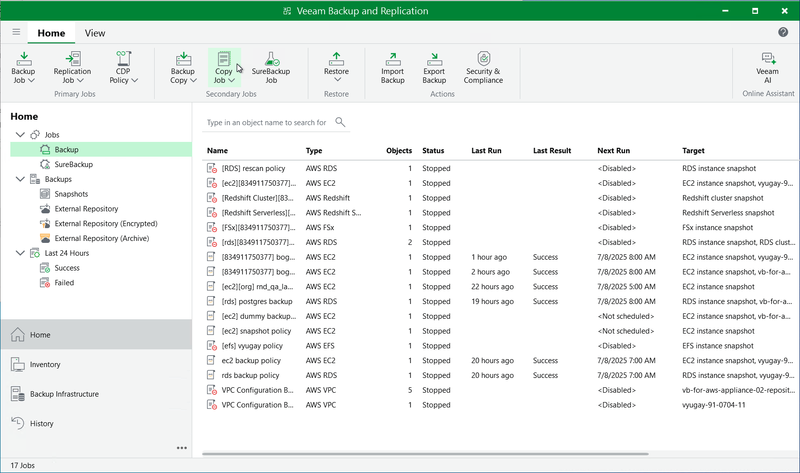

# Creating Backup Copy Jobs

Backup copy is a technology that helps you copy and store backed-up data of EC2 instances in different locations. Storing data in different locations increases its availability and ensures that data can be recovered in case a disaster strikes.

Backup copy is a job-driven process. Veeam Backup & Replication fully automates the backup copy process and lets you specify retention settings to maintain the desired number of restore points, as well as full backups for archival purposes. For more information on the backup copy functionality, see [Backup Copy](backup_copy.md).

|  |
| --- |
| Important |
| Backup copy can be performed only using EC2 backup files stored in standard backup repositories for which you have specified access keys of an IAM user whose permissions are used to access the repositories. To learn how to specify credentials for the repositories, see sections [Creating New Repositories](aws_add_s3_account.md) and [Connecting to Existing Appliances](aws_connect_appliance_repo.md). |

To create a backup copy job, do the following:

1. In the Veeam Backup & Replication console, open the Home view.
2. Click Backup Copy on the ribbon.
3. Complete the New Backup Copy Job wizard as described in section [Creating Backup Copy Jobs for VMs and Physical Machines](backup_copy_create.md).

Page updated 2026-05-21

