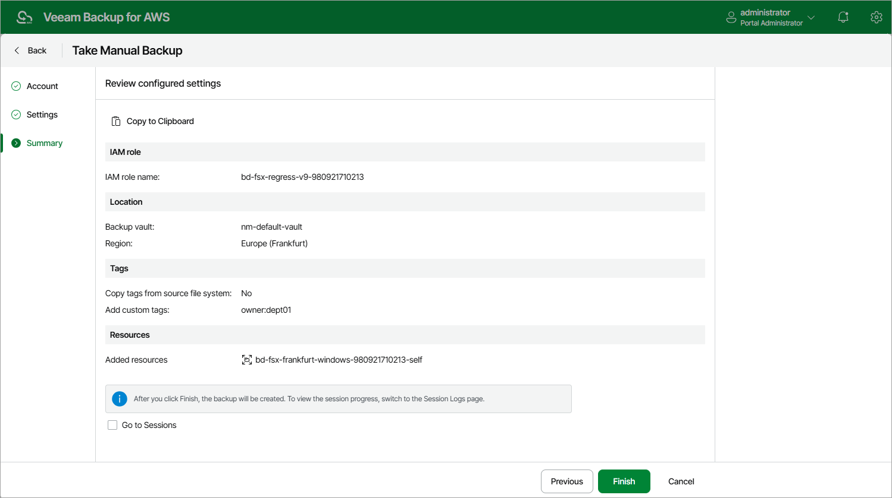

# Creating FSx Backups Manually

Veeam Plug-in for AWS allows you to manually create backups of Amazon FSx file systems. You can instruct the backup appliance to store the created backups in the same AWS Regions where the processed file systems reside, or in a different AWS Region.

|  |
| --- |
| Note |
| The backup appliance does not include FSx backups created manually in the FSx backup chain and does not apply the configured retention policy settings to these backups. This means that the backups are kept in your AWS environment unless you remove them manually, as described in section [Managing Backed-Up FSx Data](aws_backups_view_fsx.md). |

To manually create a backup of an FSx file system, do the following:

1. Navigate to Resources > File Systems > FSx.
2. Select the necessary file system and click Take Backup Now.

For an FSx file system to be displayed in the list of available file systems, an AWS Region where the file system resides must be added to any of [configured FSx backup policies](aws_add_policy_source_settings_fsx.md), and the IAM role specified in the backup policy settings or in the organization settings must have permissions to access the file system. For more information on the required permissions, see [FSx Backup IAM Role Permissions](aws_role_permissions_backup_fsx.md).

|  |
| --- |
| Important |
| Veeam Plug-in for AWS does not support taking manual backup of multiple file systems that belong to different AWS accounts or reside in different AWS Regions. |

1. Complete the Take Manual Backup wizard:

1. At the Account step of the wizard, specify an IAM role whose permissions the backup appliance will use to create the backup. The specified IAM role must belong to the same AWS account to which the processed FSx file systems reside.

For an IAM role to be displayed in the list of available roles, it must be added to the backup appliance as described in section [Adding IAM Roles](aws_iam_roles_add.md).

|  |
| --- |
| Important |
| Veeam Plug-in for AWS does not support taking manual snapshot using IAM roles specified in the [organization settings](aws_organization_add_settings.md). |

1. In the Backup vault section of the Settings step of the wizard, click Edit Location Settings.

In the Choose region and backup vault window, specify the following settings:

1. From the Target region drop-down list, choose an AWS Region where manual backups will be stored.

Since cross-region copying of FSx backups is not supported for [opt-in Regions](https://docs.aws.amazon.com/controltower/latest/userguide/opt-in-region-considerations.html), the list of available regions will depend on the original location of the selected file system. If the original location is an opt-in Region, the Target region list will contain only this AWS Region; if the original location is a default AWS Region (that is, one of the AWS Regions activated for the AWS account by default), the Target region list will contain all default AWS Regions.

1. In the Backup vault section, select a backup vault that will be used to store file system backups.

For a backup vault to be displayed in the list of available vaults, it must be created in the AWS Backup console as described in [AWS Documentation](https://docs.aws.amazon.com/aws-backup/latest/devguide/create-a-vault.html#creating-a-vault-console). If no backup vaults were created in the selected AWS Region, the backup appliance will display only the default backup vault created for the AWS Region automatically.

1. To save changes made to the location settings, click Apply.

|  |
| --- |
| Important |
| * Veeam Plug-in for AWS does not support storing backups in [logically air-gapped vaults](https://docs.aws.amazon.com/aws-backup/latest/devguide/logicallyairgappedvault.html) and in backup vaults with the [AWS Backup Vault Lock](https://docs.aws.amazon.com/aws-backup/latest/devguide/vault-lock.html) feature enabled.  * Make sure that the type of file system added to the backup scope is supported by the AWS Backup service in the source AWS Region. Otherwise, the backup operation will fail to complete successfully. For the list of supported AWS Regions, see [AWS Documentation](https://docs.aws.amazon.com/aws-backup/latest/devguide/backup-feature-availability.html#supported-services-by-region).  * Make sure policies assigned to the selected backup vault allow the backup appliance to access vault resources and to perform backup, backup copy and restore operations. For more information on vault access policies, see [AWS Documentation](https://docs.aws.amazon.com/aws-backup/latest/devguide/create-a-vault-access-policy.html).  * For the backup appliance to be able to back up FSx file systems, you must enable the Opt-in service for the FSx resource type in the AWS Backup settings. Otherwise, the backup appliance will automatically enable the service for each AWS Region specified in the backup settings in your AWS account while performing backup operations. |

1. At the Tags section of the Settings step of the wizard, if you want to assign tags to the created backup, click Edit Tag Settings.

In the Tag configuration window, specify tag settings:

1. To assign already existing AWS tags from the processed file system, select the Copy tags from source file system check box.

If you choose to copy tags from source file system, the backup appliance will first create a backup of the FSx file system and assign to the created backup AWS tags with Veeam metadata, then the backup appliance will copy tags from the processed file system and, finally, assign the copied AWS tags to the backup.

1. To assign your own custom AWS tags, set the Add custom tags to created backup toggle to On and specify the tags explicitly. To do that, use the Key and Value fields to specify a key and a value for the new custom AWS tag, and then click Add. Note that you cannot add more than 5 custom AWS tags.

If you choose to add custom tags to created backups, the backup appliance will assign the specified tags right after it creates a backup.

1. To save changes made to the tag settings, click Apply.

1. At the Summary step of the wizard, review configuration information, choose whether you want to proceed to the [Session Log page](aws_reporting.md#ui) to track the progress of snapshot creation, and click Finish.

Page updated 2026-05-21

