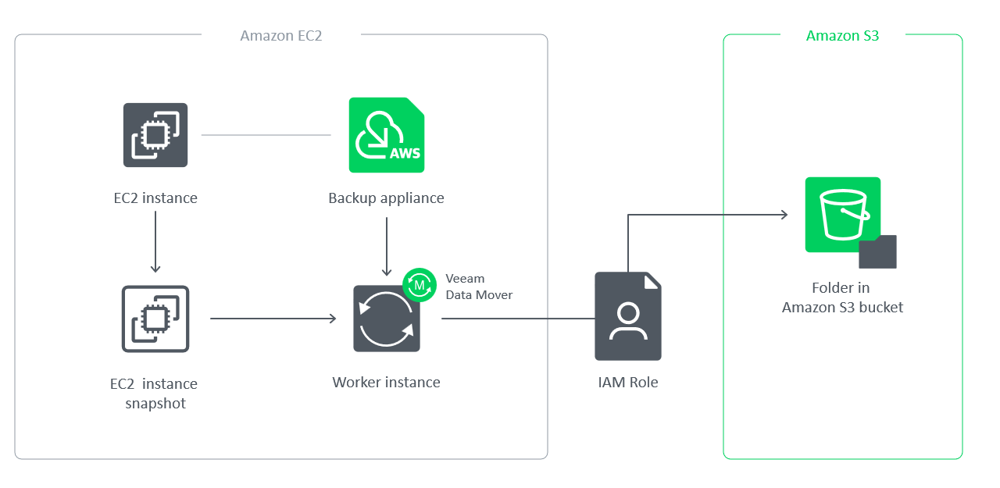

# Backup Repositories

A backup repository is a folder in an Amazon S3 bucket where backup appliances store EC2 and RDS image-level backups, additional copies of Amazon VPC backups, indexes of EFS file systems and configuration backups of standalone backup appliances.

To communicate with backup repositories, backup appliances use Veeam Data Mover — a service that runs on a [worker instance](aws_worker_instances.md) and that is responsible for data processing and transfer. When a backup policy addresses a backup repository, Veeam Data Mover establishes a connection with the repository to enable data transfer. To learn how backup appliances communicate with backup repositories, see [Managing Backup Repositories](aws_repositories.md).

|  |
| --- |
| Important |
| Backup files are stored in backup repositories in the native Veeam format and must be modified neither manually nor by 3rd party tools. Otherwise, you may not be able to restore the backed-up data. |

Encryption on Backup Repositories

For enhanced data security, you can enable encryption at the repository level. Backup appliances encrypt backup files stored in backup repositories the same way as Veeam Backup & Replication encrypts backup files stored in backup repositories. To learn what algorithms Veeam Backup & Replication uses to encrypt backup files, see [Data Encryption](data_encryption.md). To learn how to enable encryption at the repository level, see [Adding Backup Repositories](aws_repositories_add_encryption.md).

You can also back up data to S3 buckets with enabled Amazon S3 default encryption — to do that, add the S3 bucket to the backup infrastructure and use it as a target location for image-level backups. For information on Amazon S3 default encryption, see [AWS Documentation](https://docs.aws.amazon.com/AmazonS3/latest/user-guide/default-bucket-encryption.html).

Page updated 2026-05-15

