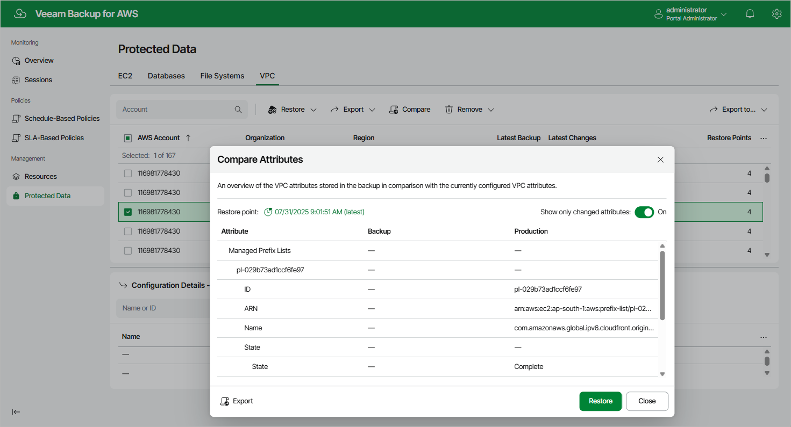

# Comparing VPC Configuration Backups

You can compare the attributes of the current Amazon VPC configuration to the attributes of a backed-up Amazon VPC configuration. To do that:

1. Navigate to Protected Data > VPC.
2. Select the necessary configuration record.
3. Click Compare.

By default, the backup appliance uses the most recent valid restore point. However, you can compare the VPC configuration data to an earlier state. To do that, click the Restore point link in the Compare Attributes window.

|  |
| --- |
| Tip |
| You can use the selected restore point to restore or export the VPC configuration. To do that, click either Restore or Export, and follow the instructions provided in section [Performing Entire Configuration Restore](aws_vpc_entire_restore.md) or [Performing Entire Configuration Export](aws_vpc_entire_export.md). |

Page updated 2026-05-21

